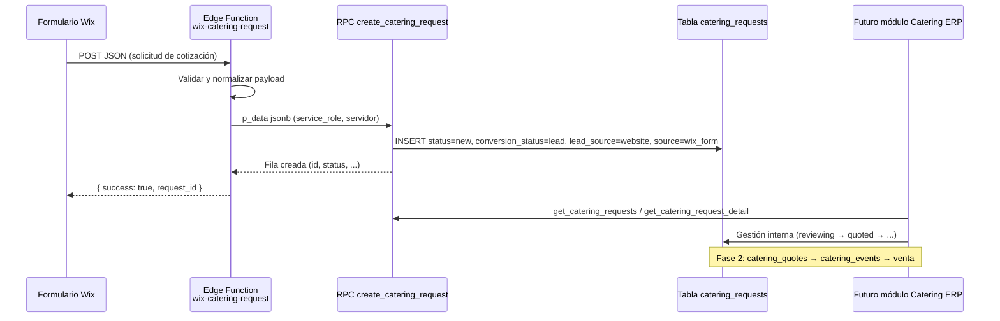

# Integración Catering: Wix → Supabase → ERP

Documentación técnica de la Fase 1 del módulo Catering. Describe cómo las solicitudes del formulario web llegan a la tabla `catering_requests` y cómo se conectarán con el futuro módulo ERP.

**Migración base:** `supabase/schema/082_catering_requests.sql`  
**Pipeline comercial (Fase 1.5):** `supabase/schema/083_catering_pipeline_phase_1_5.sql`  
**Arquitectura Fase 2 (diseño):** `docs/catering-phase-2-architecture.md`  
**Edge Function:** `supabase/functions/wix-catering-request/index.ts`

---

## Flujo completo



### Resumen por capa

| Paso | Componente | Responsabilidad |
|------|------------|-----------------|
| 1 | **Wix Form** | Captura datos del cliente y evento |
| 2 | **Edge Function** | Validación, CORS, normalización, autenticación obligatoria vía `x-wix-catering-secret` |
| 3 | **RPC `create_catering_request`** | Inserción segura en PostgreSQL (`SECURITY DEFINER`) |
| 4 | **`catering_requests`** | Lead comercial (`conversion_status = lead`) |
| 5 | **ERP Catering** | Pipeline: asignación, seguimiento, cotización, evento |

El **service role** (`SUPABASE_SERVICE_ROLE_KEY`) solo existe como secret de la Edge Function en Supabase. **Nunca** debe configurarse en Wix, en el sitio web, ni en el frontend del ERP. Wix solo conoce la URL pública de la función y el header `x-wix-catering-secret`.

El frontend del ERP usará la sesión `authenticated` con roles autorizados (`admin`, `gerente_general`, `gerente`, `gerente_operaciones`, `supervisor`).

---

## Catering Sales Pipeline

El módulo Catering opera como **embudo comercial**, no solo como almacén de formularios web.

```
Wix Form
   ↓
Lead                    (conversion_status: lead)
   ↓
Seguimiento             (contacted, follow_up_date, last_contact_at)
   ↓
Cotización              (quoted — Fase 2: catering_quotes)
   ↓
Negociación             (negotiating)
   ↓
Aprobado                (approved, estimated_value)
   ↓
Evento                  (converted → Fase 2: catering_events)
   ↓
Facturación             (Fase 2: catering_payments / POS)
```

### Campos comerciales (Fase 1.5)

| Campo | Default al crear | Uso |
|-------|------------------|-----|
| `status` | `new` | Estado operativo interno (ERP / flujo Wix) |
| `conversion_status` | `lead` | Etapa comercial del pipeline |
| `lead_source` | `website` | Atribución comercial |
| `assigned_to` | null | Responsable comercial (profiles.id) |
| `follow_up_date` | null | Próximo contacto |
| `last_contact_at` | null | Último seguimiento registrado |
| `estimated_value` | null | Valor potencial Q |

### `status` vs `conversion_status`

Son **dos dimensiones distintas** en la misma fila:

| Dimensión | Campo | Audiencia | Descripción |
|-----------|-------|-----------|-------------|
| Operativa | `status` | Equipo interno / procesos ERP | Dónde está la solicitud en el flujo operativo |
| Comercial | `conversion_status` | Ventas / pipeline / KPIs | Etapa del embudo comercial |

**No son intercambiables.** Un registro tiene siempre ambos valores. Al cambiar `status` vía `update_catering_request_status`, el sistema sincroniza `conversion_status` automáticamente.

#### Valores de `status` (operativo interno)

| Valor | Significado |
|-------|-------------|
| `new` | Recién ingresada, sin revisar |
| `reviewing` | En revisión interna |
| `quoted` | Cotización preparada internamente |
| `sent` | Propuesta enviada al cliente |
| `approved` | Aprobada internamente |
| `rejected` | Rechazada / descartada |
| `converted` | Convertida a evento (Fase 2) |

#### Valores de `conversion_status` (pipeline comercial)

| Valor | Significado |
|-------|-------------|
| `lead` | Lead nuevo |
| `contacted` | Primer contacto comercial |
| `quoted` | Cotización en juego |
| `negotiating` | Negociación activa |
| `approved` | Cliente aprobó |
| `lost` | Oportunidad perdida |
| `converted` | Convertido a evento |

#### Mapeo automático (`status` → `conversion_status`)

Función SQL: `map_catering_status_to_conversion(status)`

| status (operativo) | conversion_status (comercial) |
|--------------------|-------------------------------|
| `new` | `lead` |
| `reviewing` | `contacted` |
| `quoted` | `quoted` |
| `sent` | `negotiating` |
| `approved` | `approved` |
| `rejected` | `lost` |
| `converted` | `converted` |

`update_catering_request_status` aplica este mapeo en cada actualización.

`update_catering_followup` puede cambiar `conversion_status` directamente (seguimiento comercial) **sin** cambiar `status` — útil cuando ventas avanza el pipeline antes de que operaciones actualice el estado interno.

#### Valores al crear solicitud (Wix o ERP)

Toda solicitud nueva via `create_catering_request` entra siempre como:

```
status = new
conversion_status = lead
lead_source = website
```

El ERP puede cambiar `lead_source`, `status` o `conversion_status` después con los RPC de actualización.

### RPCs de pipeline (Fase 1.5)

| RPC | Descripción |
|-----|-------------|
| `assign_catering_lead(request_id, assigned_to)` | Asigna responsable |
| `update_catering_followup(request_id, follow_up_date?, notes?, conversion_status?, estimated_value?)` | Registra seguimiento; actualiza `last_contact_at` |
| `get_catering_pipeline_summary(date_from?, date_to?)` | KPIs del embudo |
| `get_catering_requests(status?, conversion_status?, assigned_to?, limit?, offset?)` | Listado con filtros comerciales |

#### Ejemplo: resumen del pipeline

```sql
select public.get_catering_pipeline_summary('2026-01-01', '2026-12-31');
```

Respuesta JSON:

```json
{
  "date_from": "2026-01-01",
  "date_to": "2026-12-31",
  "total_leads": 42,
  "new_leads": 12,
  "contacted_leads": 8,
  "quoted_leads": 10,
  "negotiating_leads": 5,
  "approved_leads": 4,
  "lost_leads": 2,
  "converted_leads": 1,
  "total_potential_value": 125000.00,
  "approved_total_value": 48000.00,
  "conversion_rate": 9.52
}
```

`conversion_rate` = `approved_leads / total_leads × 100` (0 si `total_leads = 0`).

Los conteos por etapa usan `conversion_status`. `total_potential_value` suma `estimated_value` en etapas activas (`lead`, `contacted`, `quoted`, `negotiating`).

#### Ejemplo: asignar y dar seguimiento

```sql
select public.assign_catering_lead(
  '<request_id>'::uuid,
  '<profile_id>'::uuid
);

select public.update_catering_followup(
  p_request_id := '<request_id>'::uuid,
  p_follow_up_date := '2026-07-01',
  p_notes := 'Cliente pidio menu vegetariano',
  p_conversion_status := 'contacted',
  p_estimated_value := 8500.00
);
```

### Qué hace Wix vs ERP

| Acción | Wix / Edge Function | ERP |
|--------|---------------------|-----|
| Crear lead | Sí | Manual opcional |
| `status = new` | Automático | — |
| `conversion_status = lead` | Automático | — |
| `lead_source = website` | Automático | Editable después vía ERP |
| Asignar responsable | No | `assign_catering_lead` |
| Seguimiento | No | `update_catering_followup` |
| Cotización formal | No | Fase 2 |
| Evento / pagos | No | Fase 2 |

Ver diseño detallado Fase 2: [catering-phase-2-architecture.md](./catering-phase-2-architecture.md).

---

Cada solicitud POST debe incluir el header:

```
x-wix-catering-secret: <valor de WIX_CATERING_WEBHOOK_SECRET>
```

| Condición | Respuesta HTTP | Body |
|-----------|----------------|------|
| Falta el header | `401` | `{ "success": false, "error": "Unauthorized" }` |
| Header no coincide con el secret | `401` | `{ "success": false, "error": "Unauthorized" }` |
| Secret no configurado en Supabase | `500` | Error de función no configurada |

Wix debe configurar este header en la automatización HTTP. El token debe ser largo, aleatorio y rotarse si se compromete.

---

## Variables de entorno / secrets

Configurar en **Supabase Dashboard → Project Settings → Edge Functions → Secrets** (o CLI `supabase secrets set`).

| Variable | Obligatoria | Descripción |
|----------|-------------|-------------|
| `SUPABASE_URL` | Sí | URL del proyecto. Supabase la inyecta al desplegar. Solo en Edge Function. |
| `SUPABASE_SERVICE_ROLE_KEY` | Sí | Clave service role. **Solo** en secrets de Supabase Edge Functions. **Nunca en Wix.** |
| `WIX_CATERING_WEBHOOK_SECRET` | Sí | Token compartido con Wix. Header obligatorio `x-wix-catering-secret`. |
| `WIX_CATERING_ALLOWED_ORIGIN` | Opcional | Origen CORS (ej. `https://www.tudominio.com`). Default: `*`. |

### Recordatorio de seguridad

- **Wix** envía: URL de la función + header `x-wix-catering-secret` + JSON del formulario.
- **Wix NO debe recibir** `SUPABASE_SERVICE_ROLE_KEY`, `SUPABASE_ANON_KEY` con privilegios elevados, ni credenciales de base de datos.
- **Frontend ERP** usa login normal; no usa service role.

### Ejemplo con CLI

```bash
supabase secrets set WIX_CATERING_WEBHOOK_SECRET=tu-token-largo-y-aleatorio
supabase secrets set WIX_CATERING_ALLOWED_ORIGIN=https://www.elgrancalcazar.com
```

`SUPABASE_URL` y `SUPABASE_SERVICE_ROLE_KEY` suelen estar disponibles automáticamente en funciones desplegadas. Verificar en el dashboard si la función falla con "Funcion no configurada".

**Longitud mínima recomendada para `WIX_CATERING_WEBHOOK_SECRET`:** 32 caracteres. No usar valores triviales como `12345`. Generar con:

```bash
# PowerShell
[Convert]::ToBase64String((1..32 | ForEach-Object { Get-Random -Maximum 256 }))

# Linux / macOS
openssl rand -base64 32
```

**`WIX_CATERING_ALLOWED_ORIGIN` en producción:** usar el dominio real del sitio Wix (ej. `https://www.elgrancalcazar.com`), no dejar `*` salvo en pruebas locales.

---

## Checklist pre-despliegue

Revisar estos tres puntos **antes** de `supabase functions deploy`:

### 1. SQL aplicado en Supabase

Ejecutar en **SQL Editor** y confirmar que devuelve filas:

```sql
-- Tabla existe
select table_name
from information_schema.tables
where table_schema = 'public'
  and table_name = 'catering_requests';

-- RPC create_catering_request existe
select routine_name
from information_schema.routines
where routine_schema = 'public'
  and routine_name = 'create_catering_request';

-- RPCs Fase 1.5 (después de aplicar 083)
select routine_name
from information_schema.routines
where routine_schema = 'public'
  and routine_name in (
    'assign_catering_lead',
    'update_catering_followup',
    'get_catering_pipeline_summary'
  );

-- Columnas pipeline (después de 083)
select column_name
from information_schema.columns
where table_schema = 'public'
  and table_name = 'catering_requests'
  and column_name in (
    'lead_source', 'assigned_to', 'follow_up_date',
    'last_contact_at', 'estimated_value', 'conversion_status'
  );
```

Si falta algo, aplicar en orden:
1. `supabase/schema/082_catering_requests.sql`
2. `supabase/schema/083_catering_pipeline_phase_1_5.sql`

Prueba rápida del RPC (como usuario service role o desde SQL con permisos):

```sql
select public.create_catering_request('{
  "customer_name": "Prueba pre-despliegue",
  "customer_phone": "50200000000",
  "guest_count": 10
}'::jsonb);
```

Luego borrar la fila de prueba si no la necesitas:

```sql
delete from public.catering_requests
where customer_name = 'Prueba pre-despliegue';
```

### 2. Secreto largo y aleatorio

| Correcto | Incorrecto |
|----------|------------|
| `K7x_mP2vQn9R...` (32+ chars, aleatorio) | `12345`, `catering`, `secret` |

El mismo valor debe configurarse en:

- Supabase secret: `WIX_CATERING_WEBHOOK_SECRET`
- Header en Wix: `x-wix-catering-secret`

### 3. CORS con dominio real

En producción:

```bash
supabase secrets set WIX_CATERING_ALLOWED_ORIGIN=https://www.tudominio-wix.com
```

Usar la URL exacta del sitio Wix (con `https://`, sin barra final). Reservar `*` solo para desarrollo.

---

## Despliegue de la Edge Function

### Prerrequisitos

1. Completar el [Checklist pre-despliegue](#checklist-pre-despliegue) (SQL, secreto, CORS).
2. [Supabase CLI](https://supabase.com/docs/guides/cli) instalada y vinculada al proyecto.

### Comandos

```bash
# Desde la raíz del repo
supabase functions deploy wix-catering-request --no-verify-jwt
```

`--no-verify-jwt` es necesario porque Wix no envía un JWT de Supabase. La seguridad se apoya en:

- Header obligatorio `x-wix-catering-secret` validado contra `WIX_CATERING_WEBHOOK_SECRET`
- Service role usado **solo** dentro de la Edge Function (secrets de Supabase)
- Validación estricta del payload
- CORS configurable con `WIX_CATERING_ALLOWED_ORIGIN`

### URL resultante

```
https://<PROJECT_REF>.supabase.co/functions/v1/wix-catering-request
```

Usar esta URL en la automatización HTTP de Wix (Velo / Automations / webhook).

---

## Prueba con curl

Sustituir `<PROJECT_REF>` y `<WIX_CATERING_WEBHOOK_SECRET>`.

**El header `x-wix-catering-secret` es obligatorio.** Sin él la función responde `401 Unauthorized`.

```bash
curl -X POST "https://<PROJECT_REF>.supabase.co/functions/v1/wix-catering-request" \
  -H "Content-Type: application/json" \
  -H "x-wix-catering-secret: <WIX_CATERING_WEBHOOK_SECRET>" \
  -d '{
    "customer_name": "María López",
    "customer_phone": "+50255551234",
    "customer_email": "maria@ejemplo.com",
    "event_date": "2026-08-15",
    "event_time": "18:00",
    "event_location": "Antigua Guatemala, Hotel Casa Santo Domingo",
    "event_type": "corporativo",
    "guest_count": 80,
    "products_requested": [
      "Buffet internacional",
      "Estación de postres",
      "Bebidas sin alcohol",
      "Meseros"
    ],
    "notes": "Montaje desde las 16:00. Cliente pide factura."
  }'
```

### Respuesta esperada (éxito)

```json
{
  "success": true,
  "request_id": "a1b2c3d4-e5f6-7890-abcd-ef1234567890",
  "status": "new"
}
```

### Respuesta sin header o secret incorrecto

```json
{
  "success": false,
  "error": "Unauthorized"
}
```

HTTP status: **401**

### Respuesta de error (validación)

```json
{
  "success": false,
  "error": "Debe enviar customer_phone o customer_email."
}
```

### Verificar en base de datos

```sql
select id, customer_name, status, source, created_at
from public.catering_requests
order by created_at desc
limit 5;
```

---

## Payload oficial de Wix

Wix debe mapear el formulario a **exactamente estos nombres de campo** en el JSON POST:

| Campo oficial | Tipo | Obligatorio | Descripción |
|---------------|------|-------------|-------------|
| `customer_name` | string | Sí | Nombre del contacto |
| `customer_phone` | string | Sí* | Teléfono (*al menos phone o email) |
| `customer_email` | string | Sí* | Correo (*al menos phone o email) |
| `event_date` | string | No | Fecha del evento (`YYYY-MM-DD` o `DD/MM/YYYY`) |
| `event_time` | string | No | Hora (`HH:MM` o `HH:MM am/pm`) |
| `event_location` | string | No | Lugar o dirección |
| `event_type` | string | No | Tipo de evento (boda, corporativo, etc.) |
| `guest_count` | number | Sí | Número de invitados (entero ≥ 1) |
| `products_requested` | array o string | No | Productos o servicios solicitados |
| `notes` | string | No | Comentarios adicionales |

La Edge Function asigna internamente `source = 'wix_form'`. No es necesario enviarlo desde Wix.

### Ejemplo — payload oficial

Ver `docs/examples/wix-catering-payload.example.json`:

```json
{
  "customer_name": "Carlos Méndez",
  "customer_phone": "50212345678",
  "customer_email": "carlos.mendez@empresa.com",
  "event_date": "2026-09-20",
  "event_time": "7:00 pm",
  "event_location": "Zona 10, Ciudad de Guatemala",
  "event_type": "cena empresarial",
  "guest_count": 45,
  "products_requested": [
    "Menú ejecutivo 3 tiempos",
    "Coctelería de bienvenida",
    "Personal de servicio"
  ],
  "notes": "Requiere opción vegetariana para 5 invitados."
}
```

### Aliases (solo compatibilidad)

La Edge Function acepta nombres alternativos por compatibilidad con formularios legacy. **Las integraciones nuevas en Wix deben usar únicamente el payload oficial.**

| Campo oficial | Aliases aceptados (legacy) |
|---------------|----------------------------|
| `customer_name` | `customerName`, `nombre`, `name` |
| `customer_phone` | `customerPhone`, `phone`, `telefono`, `tel` |
| `customer_email` | `customerEmail`, `email`, `correo` |
| `event_date` | `eventDate`, `fecha_evento`, `fecha` |
| `event_time` | `eventTime`, `hora_evento`, `hora` |
| `event_location` | `eventLocation`, `ubicacion`, `location` |
| `event_type` | `eventType`, `tipo_evento`, `tipo` |
| `guest_count` | `guestCount`, `invitados`, `personas` |
| `products_requested` | `productsRequested`, `productos`, `products` |
| `notes` | `notas`, `comentarios`, `message`, `mensaje` |

---

## Configuración en Wix (orientación)

1. Crear formulario con campos mapeados al **payload oficial** (nombres exactos).
2. En **Automations** o **HTTP function**, configurar POST a la URL de la Edge Function.
3. Agregar header obligatorio: `x-wix-catering-secret: <token>`.
4. **No** incluir `SUPABASE_SERVICE_ROLE_KEY` ni ninguna clave de Supabase en Wix.
5. Probar envío y verificar fila en `catering_requests`.

> Wix puede enviar el webhook desde servidor (recomendado) o desde el cliente. Si es desde el cliente, CORS debe permitir el origen del sitio (`WIX_CATERING_ALLOWED_ORIGIN`).

---

## Notificaciones internas (ERP)

Al crear una solicitud via `create_catering_request` (Wix Edge Function o ERP), el sistema genera notificaciones en la tabla existente `notifications` para **cada perfil activo** con rol comercial permitido.

**Migración:** `supabase/schema/084_catering_request_notifications.sql` (aplicar después de `083`).

| Campo | Valor |
|-------|-------|
| `type` | `catering_request` |
| `entity_type` | `catering_request` |
| `entity_id` | UUID de la solicitud |
| `title` | Nueva solicitud de catering |
| `message` | `{customer_name} solicitó cotización para {guest_count} invitados.` (si no hay invitados: `… solicitó cotización de catering.`) |
| `action_url` | `/catering?id={uuid}` |

**Destinatarios (roles normalizados):** `admin`, `gerente_general`, `gerente`, `gerente_operaciones`, `supervisor`, `ventas` (si existe en `profiles`; si no hay usuarios con ese rol, no falla).

**Idempotencia:** índice único `(user_id, type, entity_type, entity_id)` + `NOT EXISTS` evitan duplicados si la RPC se reintenta.

**Resiliencia:** si falla el envío de notificaciones, el lead **sí se guarda**. El error se registra como `WARNING` en PostgreSQL (`notify_new_catering_request`).

**Frontend:** la campanita (`NotificationsBell`) abre `/catering?id=…` con botón **Ver solicitud**. Lectura via RPC `get_my_notifications` (migración `085`).

---

## Cadena hacia el módulo ERP (visión)

Ver [Catering Sales Pipeline](#catering-sales-pipeline) y [catering-phase-2-architecture.md](./catering-phase-2-architecture.md).

```
catering_requests (Fase 1 + 1.5 — lead / pipeline)
       │
       ▼
catering_quotes + catering_quote_items   (Fase 2)
       │
       ▼
catering_events + staff + equipment      (Fase 2)
       │
       ▼
catering_payments                        (Fase 2)
       │
       ▼
POS / facturación                        (opcional)
```

---

## Fase 2 — Diseño (no implementado)

Documento completo: **`docs/catering-phase-2-architecture.md`**

| Tabla | Propósito |
|-------|-----------|
| `catering_quotes` | Cotización formal con totales y PDF |
| `catering_quote_items` | Líneas de la cotización |
| `catering_events` | Evento confirmado y logística |
| `catering_event_staff` | Personal asignado |
| `catering_event_equipment` | Mobiliario / equipamiento |
| `catering_payments` | Anticipos y saldo |

Pendiente además: plantillas PDF, WhatsApp/correo, frontend ERP, integración `customers` (POS).

---

## Seguridad — checklist

- [ ] Migración `082` + `083` + `084` aplicadas
- [ ] Columnas pipeline presentes (`conversion_status`, `lead_source`, …)
- [ ] RPCs `assign_catering_lead`, `update_catering_followup`, `get_catering_pipeline_summary` disponibles
- [ ] `WIX_CATERING_WEBHOOK_SECRET` ≥ 32 caracteres, aleatorio
- [ ] Mismo secret en Supabase y en header Wix `x-wix-catering-secret`
- [ ] `WIX_CATERING_ALLOWED_ORIGIN` = dominio real Wix (no `*` en producción)
- [ ] Service role **solo** en secrets de Edge Function — **nunca en Wix**
- [ ] CORS restringido al dominio Wix en producción
- [ ] `--no-verify-jwt` solo en esta función pública; no reutilizar el patrón en endpoints internos
- [ ] Monitoreo de logs: Supabase Dashboard → Edge Functions → wix-catering-request → Logs

---

## Archivos relacionados

| Archivo | Propósito |
|---------|-----------|
| `supabase/schema/082_catering_requests.sql` | Tabla base, RLS, RPCs iniciales |
| `supabase/schema/083_catering_pipeline_phase_1_5.sql` | Pipeline comercial, RPCs CRM |
| `supabase/schema/084_catering_request_notifications.sql` | Notificaciones al crear solicitud |
| `supabase/schema/085_notifications_read_rpc.sql` | RPC `get_my_notifications` + RLS normalizado |
| `docs/catering-phase-2-architecture.md` | Diseño Fase 2 (solo documentación) |
| `supabase/functions/wix-catering-request/index.ts` | Webhook Wix |
| `docs/examples/wix-catering-payload.example.json` | Payload de ejemplo |
