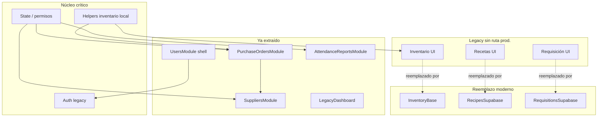

# Legacy Roadmap — LegacyInventoryApp.jsx

Mapa de módulos restantes en `frontend/src/modules/LegacyInventoryApp.jsx` para guiar la migración incremental hacia módulos independientes.

**Estado del monolito (2026-06-09, post-limpieza órdenes):**

| Métrica | Valor |
|---------|-------|
| Líneas totales | **9,356** |
| Línea base referencia | 11,539 |
| Reducción acumulada | ~18.9% (~2,183 líneas) |
| Extracciones UI completadas | 4 (Proveedores, Usuarios shell, Reportes asistencia, Órdenes de compra) |

**Estructura interna aproximada:**

| Bloque | Líneas | % |
|--------|--------|---|
| Helpers de módulo (fuera del componente) | ~730 | 7.8% |
| Cuerpo del componente (state, effects, handlers, JSX) | ~6,550 | 70.0% |
| Constantes de estilo inline (`*Style`) | ~1,975 | 21.1% |
| Export | 1 | — |

---

## Contexto de enrutamiento (crítico para priorizar)

El legacy **no es la única entrada** al producto. Varias secciones siguen en el archivo pero **ya no se cargan en producción**:

| Ruta | Secciones que usan Legacy | Secciones que ya no pasan por Legacy |
|------|---------------------------|--------------------------------------|
| `/inventory?section=…` | `ordenes` → **PurchaseOrdersModule**, `proveedores` → **SuppliersModule** | `inventario`, `inventarioAreas`, `movimientosInventario`, `requisicion`, `recetas`, `produccionInterna`, `conversiones` → módulos Supabase |
| `/hr?section=…` | Fallback (p. ej. `reportesAsistencia`) | `usuarios` → ProfileManagement, `asistencia` → AttendanceTerminal, `horarios`, `dispositivosMarcaje` |
| `/dashboard`, `/reports`, `/pos` | — | Dashboard, ReportsDashboard, POS modernos |

**Implicación:** gran parte del JSX legacy (~2,500+ líneas) es **código muerto en rutas actuales**. La prioridad operativa no es re-extraer inventario/recetas/requisición, sino **extraer lo que sigue activo** u **eliminar lo obsoleto** tras validación.

---

## Leyenda de clasificación

| Nivel | Significado |
|-------|-------------|
| **1. Ya extraído** | UI migrada a módulo propio; legacy solo wrapper o eliminado |
| **2. Fácil extracción** | UI acotada, pocas dependencias cruzadas, bajo riesgo |
| **3. Extracción media** | Formularios o flujos medianos, state compartido moderado |
| **4. Extracción compleja** | Mucho state/handlers compartido, PDF/barcode/localStorage, estilos acoplados |
| **5. Extracción crítica** | Núcleo transversal (auth, persistencia inventario, permisos); error afecta todo el módulo |

---

## Mapa de módulos

### 1. Ya extraído

#### Proveedores (`proveedores`)

| Campo | Detalle |
|-------|---------|
| Líneas aprox. | ~11 JSX wrapper + ~120 state/effects compartidos |
| Destino | `frontend/src/modules/suppliers/` |
| Dependencias | `ingredientes`, `cargarProveedoresSupabase`, `suppliersService`, `agregarNotificacion` |
| Riesgo residual | Bajo — wrapper estable |
| Prioridad | — (mantenimiento) |
| Beneficio operativo | Catálogo de proveedores ya desacoplado; usado desde `/inventory?section=proveedores` |

#### Usuarios / RRHH — shell (`usuarios`)

| Campo | Detalle |
|-------|---------|
| Líneas aprox. | ~56 JSX wrapper + **~1,050 lógica/render HR aún en legacy** |
| Destino UI | `frontend/src/modules/users/UsersModule.jsx` |
| Ruta principal prod. | `/hr?section=usuarios` → **ProfileManagement** (no Legacy) |
| Dependencias | `users` state, `renderHRDashboard`, `renderHRProfile`, turnos, crop foto, modales reset password |
| Riesgo residual | Medio — perfil/dashboard/gestión siguen como funciones internas |
| Prioridad | Media (fase 2 RRHH) |
| Beneficio operativo | Shell moderno con cards; falta extraer renderers HR (~625 líneas) |

#### Reportes de asistencia (`reportesAsistencia`)

| Campo | Detalle |
|-------|---------|
| Líneas aprox. | ~21 JSX wrapper + ~180 state/effects asistencia |
| Destino | `frontend/src/modules/attendance/` |
| Ruta prod. | `/hr?section=reportesAsistencia` |
| Dependencias | `attendanceService`, `asistenciaMovimientos`, `asistenciaLlegadasTarde`, permisos RRHH |
| Riesgo residual | Bajo |
| Prioridad | — |
| Beneficio operativo | KPIs, historial y modales fuera del monolito |

#### Órdenes de compra (`ordenes`)

| Campo | Detalle |
|-------|---------|
| Líneas aprox. (legacy residual) | ~70 JSX wrapper + ~550 handlers/state |
| Destino | `frontend/src/modules/purchase-orders/` |
| Ruta prod. | `/inventory?section=ordenes` |
| Dependencias | `ingredientes`, `proveedores`, `purchaseOrdersService`, jsPDF, notificaciones |
| Riesgo residual | Bajo — UI desacoplada; lógica aún en Legacy |
| Prioridad | — (mantenimiento; opcional mover handlers al módulo) |
| Beneficio operativo | Compras automáticas/manuales, historial, recepción y PDF con design system |

#### Módulos externos (nunca estuvieron inline o ya separados)

| Módulo | Archivo | Notas |
|--------|---------|-------|
| Dashboard legacy | `LegacyDashboard.jsx` (~68 líneas) | Wrapper ~11 líneas en Legacy |
| Sidebar | `LegacySidebar.jsx` | Navegación cuando `hideLegacyNavigation=false` |
| Reportes ejecutivos | `reports/ReportsDashboard.jsx` | Ruta `/reports` — independiente del monolito |
| Inventario Supabase | `pages/InventoryBase.jsx` | Reemplaza UI legacy de inventario |
| Requisiciones Supabase | `pages/RequisitionsSupabase.jsx` | Reemplaza UI legacy de requisición |
| Recetas Supabase | `pages/RecipesSupabase.jsx` | Reemplaza UI legacy de recetas |

---

### 2. Fácil extracción

#### Stubs de redirección (`asistencia`, `puntoVenta`)

| Campo | Detalle |
|-------|---------|
| Líneas aprox. | ~54 JSX |
| Clasificación | **2 — Fácil** (o eliminación directa) |
| Dependencias | `navigate`, permisos mínimos |
| Riesgo | Muy bajo |
| Prioridad | Baja |
| Beneficio | Limpieza; flujos reales en AttendanceTerminal y POS.jsx |
| Acción sugerida | Eliminar bloques y redirigir desde sidebar/rutas si aún aparecen |

#### Inventario por áreas — UI legacy (`inventarioAreas`)

| Campo | Detalle |
|-------|---------|
| Líneas aprox. | ~30 JSX + helpers compartidos (`getLocationStock`, `areas`) |
| Clasificación | **2 — Fácil** (eliminación; no extracción) |
| Ruta prod. | `/inventory?section=inventarioAreas` → **InventoryBase** |
| Riesgo | Bajo si se confirma que nadie monta Legacy con esta sección |
| Prioridad | Media (quick win de líneas) |
| Beneficio | −~180 líneas; menos confusión dual inventario |

#### Movimientos inventario — UI legacy (`movimientosInventario`)

| Campo | Detalle |
|-------|---------|
| Líneas aprox. | ~13 JSX |
| Clasificación | **2 — Fácil** (eliminación) |
| Ruta prod. | InventoryBase |
| Riesgo | Bajo |
| Prioridad | Media |
| Beneficio | −~50 líneas UI duplicada |

#### Dashboard wrapper (`dashboard`)

| Campo | Detalle |
|-------|---------|
| Líneas aprox. | ~11 JSX |
| Clasificación | **2 — Fácil** |
| Notas | Solo relevante si Legacy se monta con `initialSeccion=dashboard` (raro en AppRoutes actual) |
| Riesgo | Bajo |
| Prioridad | Baja |

---

### 3. Extracción media

#### Áreas operativas (`areas`)

| Campo | Detalle |
|-------|---------|
| Líneas aprox. | ~60 JSX + ~200 handlers (`createSupabaseArea`, formulario área) |
| Clasificación | **3 — Extracción media** |
| Ruta prod. | InventoryBase / settings (legacy UI no en ruta principal) |
| Dependencias | `areasService`, `users`, permisos admin |
| Riesgo | Medio |
| Prioridad | Media-baja |
| Beneficio | Admin de áreas reusable; hoy duplicado conceptualmente con InventoryBase |

#### Modales transversales (crop foto, reset password, recuperación asistencia)

| Campo | Detalle |
|-------|---------|
| Líneas aprox. | ~300 JSX + handlers |
| Clasificación | **3 — Extracción media** |
| Dependencias | react-easy-crop, HR state, asistencia recovery |
| Riesgo | Medio |
| Prioridad | Media (junto con fase 2 RRHH) |
| Beneficio | Componentes reutilizables en ProfileManagement / HR |

#### Panel de notificaciones + header shell

| Campo | Detalle |
|-------|---------|
| Líneas aprox. | ~150 |
| Clasificación | **3 — Extracción media** |
| Dependencias | `notificationsService`, `agregarNotificacion` |
| Riesgo | Bajo-medio |
| Prioridad | Media |
| Beneficio | Layout compartido entre rutas legacy restantes |

---

### 4. Extracción compleja

#### Inventario legacy (`inventario`) — **CÓDIGO MUERTO EN RUTAS ACTUALES**

| Campo | Detalle |
|-------|---------|
| Líneas aprox. | ~655 JSX + ~900 handlers + ~300 estilos + barcode scanner |
| **Total módulo** | **~1,850** |
| Clasificación | **4 — Compleja** (como extracción) / **2 — Fácil** (como eliminación) |
| Ruta prod. | `/inventory?section=inventario` → **InventoryBase** |
| Dependencias | localStorage inventario, `normalizeInventoryItem`, requisiciones embebidas, ZXing barcode, proveedor en formulario, historial cambios |
| Riesgo extracción | Alto — mucho state compartido con órdenes y proveedores |
| Riesgo eliminación | Bajo-medio — validar que no exista entry point oculto |
| Prioridad | **Alta para eliminación** (no para re-extracción) |
| Beneficio operativo | **−~1,850 líneas**; una sola fuente de verdad (Supabase) |

#### Recetas legacy (`recetas`)

| Campo | Detalle |
|-------|---------|
| Líneas aprox. | ~524 JSX + ~473 handlers + PDF receta |
| **Total** | **~1,200** |
| Clasificación | **4 — Compleja** / eliminación preferible |
| Ruta prod. | RecipesSupabase |
| Dependencias | `ingredientes`, localStorage recetas, sync POS, jsPDF |
| Riesgo | Medio en eliminación |
| Prioridad | Media-alta (deprecación) |
| Beneficio | Elimina duplicidad con RecipesSupabase |

#### Requisición legacy (`requisicion`)

| Campo | Detalle |
|-------|---------|
| Líneas aprox. | ~313 JSX + ~400 handlers |
| **Total** | **~800** |
| Clasificación | **4 — Compleja** / eliminación preferible |
| Ruta prod. | RequisitionsSupabase |
| Dependencias | `normalizeRequisition`, `inventoryMovements`, áreas, notificaciones |
| Riesgo | Medio |
| Prioridad | Media-alta (deprecación) |
| Beneficio | −~800 líneas; flujo Supabase ya operativo |

#### Renderers HR profundos (perfil, dashboard, gestión)

| Campo | Detalle |
|-------|---------|
| Líneas aprox. | ~625 funciones + ~400 estilos HR |
| Clasificación | **4 — Compleja** |
| Dependencias | MOCK_HR_EMPLOYEES, documentos, performance, turnos, acceso |
| Riesgo | Alto — mucha lógica de negocio RRHH |
| Prioridad | Media (después de órdenes) |
| Beneficio | Completar migración UsersModule / ProfileManagement |

#### Estilos globales inline

| Campo | Detalle |
|-------|---------|
| Líneas aprox. | **~2,214** (~100 constantes `*Style`) |
| Clasificación | **4 — Compleja** |
| Dependencias | Usados por múltiples secciones aún no migradas |
| Riesgo | Medio — eliminar estilo huérfano requiere grep cuidadoso |
| Prioridad | Continua (por módulo extraído) |
| Beneficio | CSS por módulo + ERP spacing system; reduce bundle |

#### Escáner de código de barras (dentro de inventario)

| Campo | Detalle |
|-------|---------|
| Líneas aprox. | ~150 handlers + UI embebida |
| Clasificación | **4 — Compleja** |
| Dependencias | `@zxing/browser`, refs de video, permisos cámara |
| Riesgo | Medio |
| Prioridad | Baja (muere con inventario legacy) |
| Beneficio | Componente reusable si InventoryBase lo necesita |

---

### 5. Extracción crítica

#### Autenticación legacy (login local + sesión `usuarioActual`)

| Campo | Detalle |
|-------|---------|
| Líneas aprox. | ~17 JSX login + ~150 handlers (`iniciarSesion`, `cerrarSesion`, bridge AuthContext) |
| Clasificación | **5 — Crítica** |
| Dependencias | localStorage usuarios, `useAuth`, permisos `hasRole`, toda la app legacy |
| Riesgo | **Muy alto** — regresiones de acceso en `/inventory` y `/hr` fallback |
| Prioridad | Última fase (cuando Legacy deje de ser entry point) |
| Beneficio | Un solo auth Supabase; elimina dualidad usuarioActual / authenticatedUser |

#### Helpers y persistencia inventario local

| Campo | Detalle |
|-------|---------|
| Líneas aprox. | ~520 (líneas 248–824) |
| Clasificación | **5 — Crítica** |
| Funciones clave | `normalizeInventoryItem`, `loadInventorySafely`, `persistInventorySafely`, requisiciones |
| Dependencias | Órdenes automáticas, proveedores, recetas legacy, localStorage |
| Riesgo | **Muy alto** — corrupción de stock si se rompe normalización |
| Prioridad | Después de migrar órdenes a Supabase puro |
| Beneficio | Elimina localStorage como fuente de inventario |

#### Núcleo state / effects / permisos

| Campo | Detalle |
|-------|---------|
| Líneas aprox. | ~800 |
| Clasificación | **5 — Crítica** |
| Dependencias | Todos los módulos restantes |
| Riesgo | Muy alto |
| Prioridad | Cierre del monolito |
| Beneficio | Permite retirar LegacyInventoryApp por completo |

#### Carga asistencia Supabase (effects compartidos)

| Campo | Detalle |
|-------|---------|
| Líneas aprox. | ~200 |
| Clasificación | **5 — Crítica** (para reportes) |
| Dependencias | `attendanceService`, reportes, logs diagnóstico |
| Riesgo | Medio-alto |
| Prioridad | Mover a hook/servicio con AttendanceReportsModule |
| Beneficio | Legacy sin effects de asistencia |

---

## Tabla resumen

| Módulo | Líneas aprox. | Riesgo | Beneficio | Prioridad | Estado |
|--------|---------------|--------|-----------|-----------|--------|
| Proveedores | ~130 (wrapper+shared) | Bajo | Alto | — | **1. Extraído** |
| Usuarios / RRHH shell | ~1,100 | Medio | Alto | P2 | **1. Extraído (parcial)** |
| Reportes asistencia | ~200 | Bajo | Alto | — | **1. Extraído** |
| **Órdenes de compra** | ~620 (wrapper+shared) | Bajo | Muy alto | — | **1. Extraído** |
| LegacyDashboard / Sidebar | ~80 ext. | Bajo | Medio | — | **1. Extraído** |
| ReportsDashboard / InventoryBase / etc. | 0 en legacy | — | Alto | — | **Moderno (fuera legacy)** |
| Eliminación inventario legacy | ~1,850 | Medio | Muy alto | **P1** | **4. Compleja / deprecar** |
| Eliminación recetas legacy | ~1,200 | Medio | Alto | P2 | **4. Compleja / deprecar** |
| Eliminación requisición legacy | ~800 | Medio | Alto | P2 | **4. Compleja / deprecar** |
| Renderers HR (perfil, dashboard) | ~1,050 | Alto | Alto | P2 | **4. Compleja** |
| Áreas operativas | ~260 | Medio | Medio | P3 | **3. Media** |
| Modales transversales | ~300 | Medio | Medio | P3 | **3. Media** |
| Stubs asistencia / POS | ~54 | Muy bajo | Bajo | P4 | **2. Fácil** |
| inventarioAreas / movimientos (legacy) | ~230 | Bajo | Medio | P3 | **2. Fácil (eliminar)** |
| Estilos inline globales | ~1,975 | Medio | Alto (bundle) | Continua | **4. Compleja** |
| Auth / sesión legacy | ~170 | Muy alto | Muy alto | P5 | **5. Crítica** |
| Helpers persistencia inventario | ~520 | Muy alto | Muy alto | P5 | **5. Crítica** |
| Núcleo state/effects | ~800 | Muy alto | Muy alto | P5 | **5. Crítica** |

---

## Diagrama de dependencias (simplificado)

---

## Recomendación: siguiente módulo

### **Deprecación UI legacy — inventario / recetas / requisición**

**Por qué:**

1. **~2,850 líneas** de JSX y handlers sin ruta de producción (`InventoryBase`, `RecipesSupabase`, `RequisitionsSupabase` ya las sirven).
2. Órdenes de compra ya está extraído y limpio — reduce riesgo de romper dependencias cruzadas.
3. Mayor impacto inmediato en tamaño del monolito (~30% adicional).

**Alcance sugerido (fase deprecación, no re-extracción):**

1. Validar que no exista entry point oculto a secciones `inventario`, `recetas`, `requisicion` en Legacy.
2. Eliminar JSX + handlers exclusivos de esas secciones.
3. Eliminar estilos huérfanos asociados.
4. Conservar helpers compartidos con órdenes (`normalizeInventoryItem`, `mapPurchaseInventoryItem`, etc.).

**Validación:** `/inventory?section=inventario|recetas|requisicion` sigue operativo vía módulos Supabase; `npm run build`.

---

## Plan de trabajo restante (5 sprints)

| Sprint | Objetivo | Reducción est. |
|--------|----------|----------------|
| 1 | Deprecar UI legacy inventario/recetas/requisición | ~2,400 |
| 2 | Extraer **renderers HR** a `users/` o ProfileManagement | ~900 |
| 3 | Extraer **áreas** + modales transversales | ~500 |
| 4 | Migrar effects asistencia + limpiar estilos huérfanos | ~800 |
| 5 | Retirar auth local y helpers inventario; eliminar LegacyInventoryApp | ~1,500+ |

**Meta:** pasar de **9,356** a **< 4,000** líneas (o retirar el archivo) con riesgo controlado.

---

## Referencias

- Progreso detallado: [legacy-extraction-progress.md](./legacy-extraction-progress.md)
- Design system: [erp-ui-spacing-system.md](./erp-ui-spacing-system.md)
- Enrutamiento inventario: `frontend/src/pages/Inventory.jsx`
- Enrutamiento RRHH: `frontend/src/pages/HR.jsx`

*Última actualización: 2026-06-09 — post-limpieza Órdenes de compra (9,356 líneas)*
