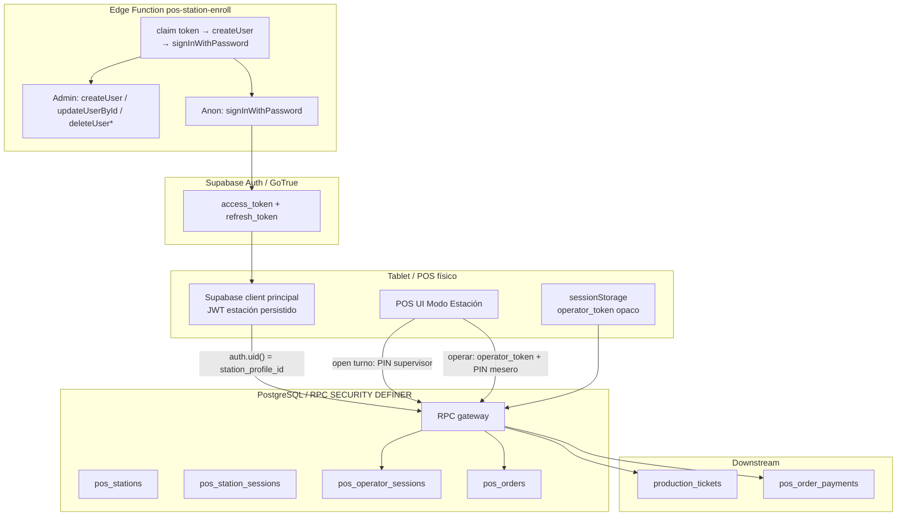
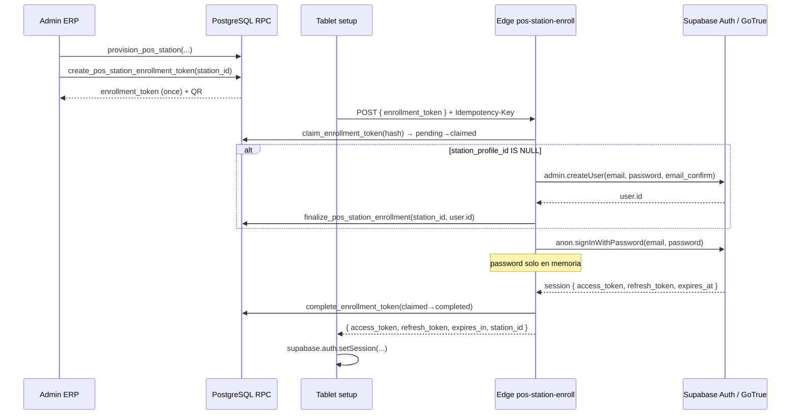
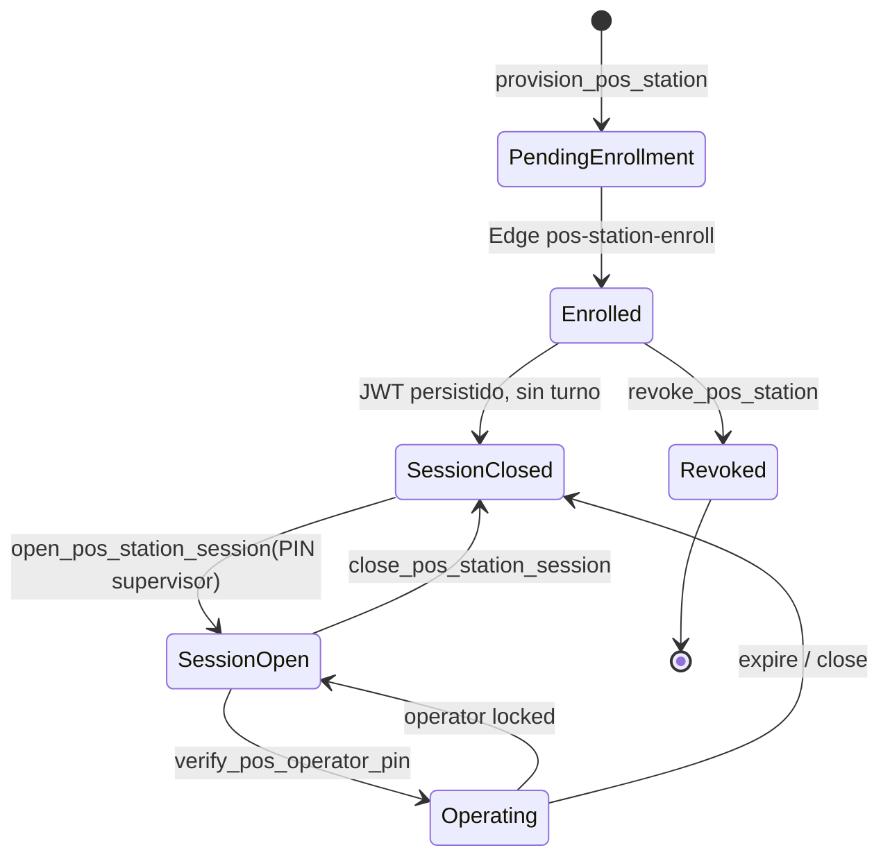
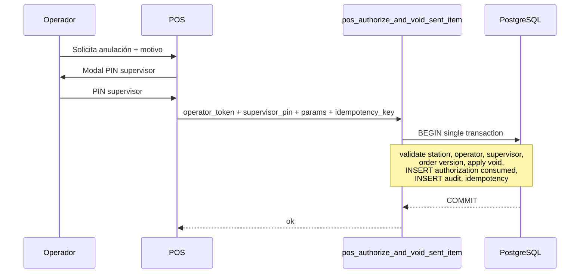

# Diseño técnico — Modo Estación POS Compartida

**Proyecto:** ERP El Gran Alcázar  
**Módulo:** Punto de Venta (POS)  
**Versión del documento:** 1.2.1 (revocación Auth Admin corregida)  
**Estado:** Diseño aprobado — sin implementación  
**Base:** Auditoría técnica POS (2026-07) verificada contra repositorio `alcazar-inventario`

---

## 1. Resumen ejecutivo

### Problema operativo

En el restaurante, varios meseros comparten la misma tablet o computadora POS. Hoy cada mesero debería iniciar y cerrar sesión personal en Supabase Auth, lo que genera retrasos durante el servicio y favorece el uso compartido de credenciales.

### Limitación técnica actual

El POS opera con **una identidad Supabase Auth por navegador** (`profiles.id = auth.uid()`). Esa identidad:

- fija `pos_orders.waiter_id` al crear la orden (`frontend/src/services/posOrdersService.js`, RLS `pos_orders_operators_insert` en `supabase/schema/010_pos_orders.sql`);
- alimenta ranking y propinas vía `waiter_id` (`get_waiter_sales_ranking` en `supabase/schema/048_sales_goals_and_motivational_reports.sql`);
- registra auditoría con `created_by = auth.uid()` en triggers y RPC;
- no distingue estación, operador temporal, propietario, actor ni autorizador.

Además existen huecos de integridad (transferencias solo en React, caja híbrida localStorage + Supabase) documentados en la auditoría.

### Arquitectura seleccionada

**Estación registrada + sesión de estación abierta por supervisor (PIN, sin JWT personal) + sesión operativa por PIN**, con **mutaciones críticas vía RPC** que derivan identidades desde sesiones validadas en servidor.

Componentes clave v1.2:

1. **Enrollment JWT:** Edge Function `pos-station-enroll` — `auth.admin.createUser` + `auth.signInWithPassword` (GoTrue emite tokens; **no** `auth.admin.createSession`, inexistente en API oficial).
2. **Apertura diaria:** dispositivo conserva JWT de estación; supervisor abre turno con PIN vía RPC — sin reemplazar JWT.
3. **PIN operador:** unicidad global entre activos + columna `pin_lookup_key` (HMAC) para resolución O(1) + bcrypt para verificación.
4. **Autorizaciones sensibles:** una sola RPC atómica por acción (`pos_authorize_and_*`).
5. **Precios:** servidor calcula todo; cliente envía solo IDs y cantidades.

### Resultado esperado

- Meseros se identifican en segundos con PIN.
- Ventas, ranking y propinas siguen al **propietario de la orden** (primer mesero que la crea).
- Cada acción registra al **operador real**.
- Acciones sensibles requieren **autorización de supervisor** en la misma transacción que la acción.
- Supabase es fuente de verdad; localStorage solo para UI efímera.
- Rollout gradual con feature flags server-side.

### Alcance y exclusiones

| Incluido | Excluido (v1) |
|----------|-----------------|
| Estaciones, sesiones, PIN POS, RPC gateway, auditoría estructurada | Rediseño completo de catálogo POS |
| Fase 0 de integridad previa | Modo offline completo |
| Edge Function de enrollment (diseñada; implementación F1) | NFC / tarjetas físicas |
| Integración KDS preservando dispatch existente | Reutilizar PIN de asistencia |
| Transición caja hacia Supabase (bloqueantes definidos) | Big-bang cutover |

---

## 2. Objetivos y no objetivos

### Objetivos mínimos

1. **Estaciones compartidas** — un dispositivo, múltiples meseros sin login/logout personal.
2. **Identificación rápida** — PIN numérico, objetivo p95 &lt; 500 ms validación server-side.
3. **Atribución individual** — actor por acción; propietario por orden.
4. **Seguridad server-side** — operador, propietario, autorizador y estación derivados de sesiones validadas.
5. **Auditoría** — trazabilidad estructurada (no solo texto libre).
6. **Compatibilidad gradual** — POS legacy por usuario mientras flag apagado.
7. **Operación rápida** — bloqueo automático post-envío e inactividad (30 s).

### No objetivos iniciales

- Reemplazar todo el POS de una vez.
- Rediseñar catálogo, croquis o KDS más allá de campos de identidad en tickets.
- Reutilizar `attendance_credentials` / PIN de asistencia (`019_attendance_terminal.sql`).
- Operación anónima (siempre hay operador identificado o estación bloqueada).
- Offline-first completo (no existe hoy).

---

## 3. Estado actual

### Autenticación y acceso

| Capa | Implementación | Referencia |
|------|----------------|------------|
| Login | Supabase Auth → `profiles` | `frontend/src/context/AuthContext.jsx` |
| Route guard | `ProtectedRoute module="pos"` | `frontend/src/routes/AppRoutes.jsx:92` |
| Permisos módulo | `ROLE_PERMISSIONS` → `canAccess("pos")` | `AuthContext.jsx:30-62` |
| Gate in-page | `POS_ROLES = ["admin","gerente_general","supervisor","mesero","caja"]` | `POS.jsx:131, 4075` |
| Roles DB POS | `can_operate_pos_orders()` | `046_pos_customers_sales_channels.sql:52-66` |

**Inconsistencia:** `cajero`, `servicio`, `gerente_operaciones` tienen módulo `pos` en router pero pueden quedar bloqueados en `POS.jsx`.

Sesión Auth: persistencia default de `@supabase/supabase-js` (localStorage). Puente legacy: `usuarioActual` en localStorage (`AuthContext.jsx:144-158`).

### Creación de órdenes

```
POS.jsx confirmarAgregarItem
  → createOrGetOpenOrder(tableData, user)
    → INSERT pos_orders { waiter_id: currentUser.id, waiter_name, ... }
```

RLS INSERT exige `waiter_id = auth.uid()` (`010_pos_orders.sql:104-106`).

### Dependencia de `auth.uid()`

- RLS órdenes, items, eventos (triggers), pagos RPC (`create_pos_split_payment`, `064`).
- Cash: `opened_by`, `created_by` (`045_cash_sessions_and_movements.sql`).
- Ranking: usa `waiter_id` de órdenes pagadas.

### Auditoría actual

- **`pos_order_events`**: `event_type`, `description`, `created_by`, `created_at` (`010_pos_orders.sql:50-57`).
- Trigger `audit_pos_order_change` (`011_fix_pos_order_audit.sql`).
- Caja: `financialAuditLog` en localStorage (`cashier.js`).

### Caja híbrida

| Capa | Fuente | Archivo |
|------|--------|---------|
| Operación mesero → precuenta | Supabase órdenes + localStorage `preBills` | `cashier.js`, `POS.jsx` |
| Cobro UI | `confirmPayment` → localStorage | `Cashier.jsx` |
| Sync parcial Supabase | `syncSupabaseFullPayment` → `create_pos_split_payment` | `cashier.js:497` |

### Operaciones no persistidas

| Operación | Referencia |
|-----------|------------|
| Transferir mesa | `POS.jsx:4038-4072` — solo React |
| Cancelar ítem enviado | `POS.jsx:3904-3927` — parcial local |

### Edge Functions

Ninguna relacionada con POS hoy (`supabase/functions/`). **v1.2 define Edge Function de enrollment (F1) con APIs Auth documentadas.**

---

## 4. Arquitectura objetivo



### Relación de identidades

| Identidad | Quién | Persistencia | Uso |
|-----------|-------|--------------|-----|
| **Estación** | Dispositivo registrado | `pos_stations` | Scope de sesiones y auditoría |
| **JWT estación** | GoTrue (usuario Auth técnico) | localStorage via Supabase client | `auth.uid()` = `station_profile_id` |
| **Apertura estación** | Supervisor (PIN) | `pos_station_sessions.opened_by_profile_id` | Habilita turno; **no** deja JWT supervisor |
| **Operador** | Mesero (PIN) | `pos_operator_sessions` + token opaco | Actor de acciones |
| **Propietario** | Primer mesero creador | `pos_orders.owner_profile_id` | Ventas, ranking, propinas |
| **Autorizador** | Supervisor (PIN en RPC atómica) | `pos_authorizations` + eventos | Acciones sensibles |

---

## 5. Decisión sobre identidad técnica de la estación

### Opciones evaluadas (emisión de sesión)

| Opción | API oficial | Veredicto |
|--------|-------------|-----------|
| **A. `createUser` + `signInWithPassword`** | [createUser](https://supabase.com/docs/reference/javascript/auth-admin-createuser), [signInWithPassword](https://supabase.com/docs/reference/javascript/auth-signinwithpassword) | **Seleccionada v1.2** |
| **B. `generateLink` + `verifyOtp`** | [generateLink](https://supabase.com/docs/reference/javascript/auth-admin-generatelink), [verifyOtp](https://supabase.com/docs/reference/javascript/auth-verifyotp) | Rechazada — flujo diseñado para email/OTP humano; añade paso intermedio sin ventaja para dispositivo |
| **C. `auth.admin.createSession`** | — | **Rechazada** — **no existe** en la documentación oficial Auth Admin |
| **D. RPC PostgreSQL emite JWT** | — | Rechazada — GoTrue emite tokens, no PostgreSQL |

### Decisión final: **Edge Function `pos-station-enroll` + `createUser` + `signInWithPassword`**

#### APIs Auth reales utilizadas

| Operación | Cliente | Método oficial |
|-----------|---------|----------------|
| Crear usuario técnico | Admin (`service_role`) | `supabaseAdmin.auth.admin.createUser({ email, password, email_confirm: true, app_metadata })` |
| Obtener sesión GoTrue | Anon (`persistSession: false`) | `supabaseAnon.auth.signInWithPassword({ email, password })` → `{ session: { access_token, refresh_token, expires_at }, user }` |
| Bloquear usuario técnico (revocación) | Admin | `supabaseAdmin.auth.admin.updateUserById(userId, { ban_duration: '876000h' })` — [updateUserById](https://supabase.com/docs/reference/javascript/auth-admin-updateuserbyid) |
| Invalidar sesión Auth puntual (opcional) | Admin | `supabaseAdmin.auth.admin.signOut(jwt, 'global')` — [signOut](https://supabase.com/docs/reference/javascript/auth-admin-signout) — **requiere JWT válido**, no `userId` |
| Eliminar usuario técnico | Admin | `supabaseAdmin.auth.admin.deleteUser(userId)` — **solo** si no existen FK ni auditoría histórica vinculada; ver §5.1 |

**Eliminado del diseño:** `auth.admin.createSession()` — no documentado en Auth Admin.

#### Respuestas obligatorias (enrollment)

| # | Pregunta | Respuesta concreta v1.2 |
|---|----------|-------------------------|
| 1 | ¿Quién crea el usuario Auth? | Edge Function (service role) → `auth.admin.createUser()` |
| 2 | ¿Quién emite el access token? | **GoTrue**, respuesta de `auth.signInWithPassword()` |
| 3 | ¿Quién emite el refresh token? | **GoTrue**, mismo objeto `session` de `signInWithPassword()` |
| 4 | ¿Cómo recibe la sesión el navegador? | Edge Function responde `{ access_token, refresh_token, expires_in, station_id, station_name }`; frontend → `supabase.auth.setSession({ access_token, refresh_token })` |
| 5 | ¿Qué se almacena en el navegador? | Par tokens en **localStorage** (cliente Supabase principal). **Nunca** contraseña técnica, service role ni enrollment token |
| 6 | ¿Vinculación `auth.uid()` ↔ estación? | RPC `finalize_pos_station_enrollment(station_id, auth_user_id)` asigna `pos_stations.station_profile_id`; crea/actualiza `profiles` rol `pos_station` |
| 7 | ¿Revocación? | Ver §5.1 — efecto inmediato vía `status != 'active'` en RLS/RPC; JWT puede existir hasta expirar |
| 8 | ¿Reemplazo dispositivo? | Revocar identidad anterior; conservar histórico; **nueva** identidad Auth + nuevo enrollment; ver §5.1 |
| 9 | ¿Evitar contraseña permanente? | Password aleatoria 256 bits **solo en memoria** Edge Function; destruida al terminar request; operación normal usa refresh token |
| 10 | ¿Service role? | **Solo** Edge Function admin client. Nunca en respuesta, frontend, logs ni RPC |

#### Estrategia del enrollment token (v1.2)

El código corto 6–8 caracteres es **insuficiente** para un endpoint que entrega sesión persistente.

| Propiedad | Valor |
|-----------|-------|
| Entropía | **≥ 128 bits** (`crypto.getRandomValues` → 16 bytes) |
| Representación | **base64url** (~22 caracteres) — preferible en **QR** |
| TTL | **15 minutos** |
| Almacenamiento BD | Solo **`token_hash`** = SHA-256(enrollment_token); **nunca** token plano |
| Uso | Un solo uso; estados en BD (ver §6.2) |
| Respuesta inválida | Genérica `ENROLLMENT_INVALID` (misma forma para expirado, consumido, hash incorrecto) |

Admin RPC `create_pos_station_enrollment_token(station_id)` genera token, persiste hash, devuelve token plano **una vez** (UI admin → QR).

#### Secuencia completa: enrollment → sesión



**Pasos detallados (Edge Function `pos-station-enroll`):**

1. Recibir `enrollment_token` (base64url) + header `Idempotency-Key` + optional `station_code` cross-check.
2. Calcular `token_hash = SHA-256(enrollment_token)`.
3. RPC **`claim_pos_station_enrollment_token(token_hash, idempotency_key)`** — transacción PostgreSQL:
   - Valida `status='pending'`, `expires_at > now()`, estación no `revoked`.
   - `UPDATE … SET status='claimed', claimed_at=now(), claim_idempotency_key=… WHERE status='pending'`.
   - Si ya `claimed` con **misma** idempotency key y &lt; 5 min → permitir retry (continuar paso 4–7).
   - Si `completed` → rechazar (no re-entregar sesión).
4. Si `station_profile_id` IS NULL:
   - Email técnico: `pos-station-{station_id}@internal.invalid` (dominio no enrutable).
   - Password: 32 bytes aleatorios → base64, **solo variable local**.
   - `adminClient.auth.admin.createUser({ email, password, email_confirm: true, app_metadata: { type: 'pos_station', station_id } })`.
5. RPC **`finalize_pos_station_enrollment(station_id, user.id)`** — profile `pos_station`, `station_profile_id`, `status='active'`.
   - **Si falla:** compensación → `admin.deleteUser(user.id)`; enrollment → `failed`; abortar.
6. Cliente anon (`persistSession: false`, `autoRefreshToken: false`):
   - `anonClient.auth.signInWithPassword({ email, password })`.
   - Password borrada de memoria inmediatamente después.
7. RPC **`complete_pos_station_enrollment_token(token_hash, auth_user_id)`** → `status='completed'`.
   - **Si falla tras signIn:** compensación §5.2; no re-entregar tokens duplicados sin idempotency controlada.
8. HTTP 200 + headers `Cache-Control: no-store` + body session (sin password, sin service role).
9. Navegador: `supabase.auth.setSession({ access_token, refresh_token })`.

**Pérdida de refresh token:** no hay recuperación por contraseña. Admin revoca estación/usuario Auth y emite **nuevo** enrollment token supervisado.

#### §5.1 Revocación (métodos reales — v1.2.1)

**Corrección API:** `auth.admin.signOut` recibe un **JWT válido** (`jwt`) y `scope`, **no** un `userId`. Ver [signOut](https://supabase.com/docs/reference/javascript/auth-admin-signout).

**No afirmar** que los refresh tokens se revocan mediante `signOut(userId)`. El mecanismo principal de revocación operativa es **`status = 'revoked'` en BD + ban Auth**, que bloquea operación inmediatamente aunque el access token JWT siga siendo criptográficamente válido hasta su expiración natural.

##### Orden obligatorio (`revoke_pos_station` / admin)

```text
1. pos_stations.status = 'revoked', revoked_at = now()
2. Cerrar TODAS pos_station_sessions abiertas (status = 'closed')
3. Cerrar TODAS pos_operator_sessions no terminales (status = 'closed' o 'expired')
4. auth.admin.updateUserById(station_profile_id, { ban_duration: '876000h' })
5. (Opcional) auth.admin.signOut(jwt, 'global') — ver condiciones abajo
```

##### Validación obligatoria en RPC y RLS (efecto inmediato)

Toda RPC gateway **y** toda política RLS de lectura/escritura para JWT estación debe verificar **simultáneamente**:

```text
auth.uid() = pos_stations.station_profile_id
AND pos_stations.status = 'active'
```

Helper recomendado:

```sql
CREATE OR REPLACE FUNCTION public.is_active_pos_station_profile(p_profile_id uuid)
RETURNS boolean
LANGUAGE sql STABLE SECURITY DEFINER
SET search_path = '', public
AS $$
  SELECT EXISTS (
    SELECT 1 FROM public.pos_stations s
    WHERE s.station_profile_id = p_profile_id
      AND s.status = 'active'
  );
$$;
```

**Consecuencia:** un access token ya emitido puede existir hasta expirar, pero **RLS y RPC lo rechazan de inmediato** cuando `station.status != 'active'`. El refresh token tampoco produce sesión operativa útil porque el ban impide renovación/sign-in.

##### `auth.admin.signOut(jwt, 'global')` — uso restringido

| Permitido | Prohibido |
|-----------|-----------|
| Durante enrollment, sobre el JWT recién emitido si se requiere abortar antes de entregarlo al cliente | Almacenar JWT de estación en BD **únicamente** para revocación futura |
| Si admin recibe legítimamente un access token vigente (ej. reporte robo con token capturado en incident response) | Invocar `signOut(userId, …)` — **firma incorrecta** |
| Como acción puntual complementaria, no como pilar de revocación | Asumir que invalida refresh tokens sin ban ni status revoked |

##### Reemplazo de dispositivo (sin borrar histórico)

1. Ejecutar revocación §5.1 sobre la identidad/dispositivo anterior (`status = 'revoked'`, sesiones cerradas, ban del `station_profile_id` anterior).
2. **Conservar** filas históricas (`pos_orders`, `pos_order_events`, pagos, auditoría) — FKs permanecen; `station_id` histórico no se reescribe.
3. **No** ejecutar `deleteUser` automáticamente si el usuario técnico tiene FK o auditoría vinculada — el ban + `revoked` es suficiente.
4. Admin provisiona **nueva** identidad: nuevo enrollment token → Edge Function → **`createUser` nuevo** (nuevo `station_profile_id`) o re-enrollment sobre estación reseteada a `pending_enrollment` según procedimiento operativo.
5. Dispositivo nuevo completa enrollment; operación normal resume con nueva identidad Auth.

##### Tabla resumen métodos

| Objetivo | Método | Cuándo |
|----------|--------|--------|
| Denegar operación inmediata | `pos_stations.status = 'revoked'` + RLS/RPC | **Siempre primero** |
| Cerrar turnos/sesiones | RPC cascade close station + operator sessions | Paso 2–3 |
| Impedir refresh/sign-in futuro | `updateUserById(id, { ban_duration: '876000h' })` | **Paso 4 — mecanismo Auth principal** |
| Invalidar sesión Auth puntual | `signOut(jwt, 'global')` | Solo si se posee JWT legítimo; opcional |
| Eliminar usuario Auth | `deleteUser(id)` | Solo sin FK/auditoría; **no** en reemplazo estándar |
| Cierre turno (no revocación) | `close_pos_station_session` | Fin de servicio normal |

#### §5.2 Compensación Auth ↔ PostgreSQL (sin transacción compartida)

| Escenario | Acción compensatoria |
|-----------|---------------------|
| **A.** `createUser` OK, `finalize_pos_station_enrollment` falla | `auth.admin.deleteUser(user.id)`; enrollment → `failed`; respuesta genérica error |
| **B.** Enrollment `claimed`, `createUser` falla | enrollment → `pending` si retry permitido (&lt; 5 min, misma idempotency) o `failed`; no orphan user |
| **C.** `signInWithPassword` OK, `complete_enrollment_token` falla | **Crítico:** usuario Auth existe y tokens emitidos. Marcar enrollment `completed` en retry idempotente; si imposible, admin revoca user + nuevo token. Log auditoría `enrollment_complete_failed` sin tokens |
| **D.** Request duplicada misma idempotency | Si `completed` → **no** re-entregar sesión (`ENROLLMENT_ALREADY_USED`); admin debe emitir nuevo token |
| **E.** Respuesta HTTP perdida tras éxito | Token ya `completed` → **no** reutilizable. Recuperación: admin revoca opcionalmente + **nuevo** enrollment token |

Estados enrollment: `pending` → `claimed` → `completed` | `failed` | `revoked`.

#### §5.3 Idempotencia enrollment

- Header HTTP **`Idempotency-Key`** (UUID) obligatorio en Edge Function.
- UNIQUE `(claim_idempotency_key)` en fila enrollment mientras `claimed`/`completed`.
- Retry seguro solo en ventana **5 min** post-claim con misma key (continúa flujo Auth, no crea segundo user).
- **Nunca** entregar segunda sesión completa por mismo enrollment token completado.

#### §5.4 Requisitos de seguridad del endpoint Edge

| Control | Implementación |
|---------|----------------|
| HTTPS | Obligatorio (Supabase Edge) |
| CORS | Allowlist orígenes ERP producción/staging |
| Cache | `Cache-Control: no-store`, `Pragma: no-cache` |
| Logs | Sin tokens, passwords, enrollment_token, service role |
| Respuesta | Nunca incluir service role key |
| Rate limit | Por IP + por `station_id` inferido post-hash (bucket 10/15 min) |
| Token | Single-use, TTL 15 min, SHA-256 en BD |
| Replay | Estado `completed` rechaza; hash no reversible |
| Auditoría | Evento `pos_station_enrollment_completed` con `station_id`, sin secretos |

#### Interacción con RLS

- JWT estación accede solo si `auth.uid() = station_profile_id` **y** `pos_stations.status = 'active'` — aplica a **SELECT y mutaciones**, no solo RPC.
- Mutaciones críticas: **solo RPC**, con las mismas validaciones de estación activa.
- Estación revocada: políticas SELECT deniegan lectura operativa aunque el JWT no haya expirado.

---

## 6. Modelo de datos propuesto

### 6.1 `pos_stations`

| Columna | Tipo | Null | FK | Default | Propósito |
|---------|------|------|-----|---------|-----------|
| `id` | uuid | NO | — | gen_random_uuid() | PK estación |
| `code` | text | NO | — | — | Código único (`SALON-1`) |
| `name` | text | NO | — | — | Nombre visible |
| `location_label` | text | YES | — | — | Ubicación física |
| `branch_id` | text | YES | — | — | **Texto deliberado v1** — no existe tabla `branches`; migrar a FK uuid cuando exista entidad sucursal |
| `station_profile_id` | uuid | YES | profiles(id) | — | NULL hasta enrollment; luego NOT NULL |
| `status` | text | NO | — | `'pending_enrollment'` | CHECK: pending_enrollment, active, inactive, revoked |
| `metadata` | jsonb | NO | — | `'{}'` | Config UI |
| `created_at` | timestamptz | NO | — | now() | — |
| `updated_at` | timestamptz | NO | — | now() | — |
| `revoked_at` | timestamptz | YES | — | — | Revocación |

**Índices:** UNIQUE(`code`); INDEX(`status`); UNIQUE(`station_profile_id`) WHERE NOT NULL.

---

### 6.2 `pos_station_enrollment_tokens`

| Columna | Tipo | Null | Propósito |
|---------|------|------|-----------|
| `id` | uuid | NO | PK |
| `station_id` | uuid | NO | FK pos_stations |
| `token_hash` | text | NO | SHA-256(enrollment_token); **nunca** token plano |
| `status` | text | NO | CHECK: pending, claimed, completed, failed, revoked |
| `expires_at` | timestamptz | NO | TTL 15 min desde creación |
| `claimed_at` | timestamptz | YES | Inicio consumo |
| `completed_at` | timestamptz | YES | Sesión entregada |
| `claim_idempotency_key` | uuid | YES | Header Idempotency-Key del consumo |
| `auth_user_id` | uuid | YES | Usuario Auth creado/vinculado |
| `created_by` | uuid | NO | Admin |
| `created_at` | timestamptz | NO | — |
| `updated_at` | timestamptz | NO | — |
| `failure_reason` | text | YES | Código interno; no expuesto con detalle al cliente |

**Índices:** UNIQUE(`token_hash`); INDEX(`station_id`, `status`); INDEX(`expires_at`).

**Generación (admin RPC):** 128 bits aleatorios → base64url; hash persistido; token plano retornado una vez para QR.

**Nombre legacy:** sustituye el concepto `pos_station_enrollment_codes` de v1.1.
---

### 6.3 `pos_station_sessions`

| Columna | Tipo | Null | FK | Default | Propósito |
|---------|------|------|-----|---------|-----------|
| `id` | uuid | NO | — | gen_random_uuid() | PK |
| `station_id` | uuid | NO | pos_stations | — | Estación |
| `opened_by_profile_id` | uuid | NO | profiles | — | Supervisor (validado por PIN) |
| `closed_by_profile_id` | uuid | YES | profiles | — | Cierre |
| `status` | text | NO | — | `'open'` | CHECK: open, closed, expired |
| `opened_at` | timestamptz | NO | — | now() | — |
| `closed_at` | timestamptz | YES | — | — | — |
| `expires_at` | timestamptz | NO | — | — | Fin turno |
| `opening_notes` | text | YES | — | — | — |
| `metadata` | jsonb | NO | — | `'{}'` | — |
| `updated_at` | timestamptz | NO | — | now() | — |

**Índices:** UNIQUE parcial `(station_id) WHERE status = 'open'`.

---

### 6.4 `pos_operator_credentials`

| Columna | Tipo | Null | FK | Default | Propósito |
|---------|------|------|-----|---------|-----------|
| `profile_id` | uuid | NO | profiles(id) | — | PK empleado |
| `pin_hash` | text | NO | — | — | bcrypt `crypt()` |
| `pin_lookup_key` | text | NO | — | — | HMAC-SHA256(pepper_vault, pin_normalizado) — **único entre activos** |
| `failed_attempts` | int | NO | — | 0 | Solo tras identificación exitosa del perfil |
| `locked_until` | timestamptz | YES | — | — | Bloqueo por perfil |
| `updated_by` | uuid | YES | profiles | — | RRHH/admin |
| `updated_at` | timestamptz | NO | — | now() | — |
| `revoked_at` | timestamptz | YES | — | — | Revocación |

**Índices:** UNIQUE parcial `(pin_lookup_key) WHERE revoked_at IS NULL`.

**Seguridad:** sin SELECT para authenticated operativo; pepper en Supabase Vault / secret Edge, no en tabla.

---

### 6.5 `pos_pin_attempt_buckets` (rate limit sin perfil conocido)

| Columna | Tipo | Propósito |
|---------|------|-----------|
| `id` | uuid | PK |
| `station_id` | uuid | Estación |
| `station_session_id` | uuid | Sesión estación |
| `window_started_at` | timestamptz | Inicio ventana |
| `attempt_count` | int | Intentos en ventana |
| `locked_until` | timestamptz | Bloqueo estación/sesión |
| `updated_at` | timestamptz | — |

**Retención:** purgar filas &gt; 7 días (job programado).

**Índices:** UNIQUE(`station_session_id`, `window_started_at`) o bucket por ventana de 15 min.

---

### 6.6 `pos_operator_sessions`

| Columna | Tipo | Null | FK | Default | Propósito |
|---------|------|------|-----|---------|-----------|
| `id` | uuid | NO | — | gen_random_uuid() | **Identificador interno** — no bearer |
| `station_session_id` | uuid | NO | pos_station_sessions | — | Sesión estación |
| `station_id` | uuid | NO | pos_stations | — | Denormalizado para validación rápida |
| `operator_profile_id` | uuid | NO | profiles | — | Mesero |
| `token_hash` | text | NO | — | — | SHA-256 del token opaco entregado al cliente |
| `status` | text | NO | — | `'active'` | CHECK: active, locked, closed, expired |
| `started_at` | timestamptz | NO | — | now() | — |
| `last_activity_at` | timestamptz | NO | — | now() | Actualizado por **RPC reales**, no heartbeat |
| `expires_idle_at` | timestamptz | NO | — | — | now() + 30 s (renovable por RPC) |
| `expires_absolute_at` | timestamptz | NO | — | — | now() + 8 h — **tope duro** |
| `locked_at` | timestamptz | YES | — | — | — |
| `closed_at` | timestamptz | YES | — | — | — |
| `close_reason` | text | YES | — | — | manual, send_kds, idle, station_closed, replaced |
| `metadata` | jsonb | NO | — | `'{}'` | — |
| `updated_at` | timestamptz | NO | — | now() | — |

**Índices:**

```sql
CREATE UNIQUE INDEX pos_operator_sessions_one_active
  ON public.pos_operator_sessions (station_session_id)
  WHERE status = 'active';
```

**Regla `locked`:** status `locked` **no** ocupa el índice único de activos; un nuevo PIN puede crear sesión `active` tras cerrar/atómico reemplazar la anterior `locked`.

**Concurrencia dos pestañas:** segunda activación en transacción SERIALIZABLE — una gana `active`, la otra recibe `OPERATOR_SESSION_REPLACED` y debe re-PIN.

---

### 6.7 `pos_authorizations`

Usada para **previsualización UI** y trazabilidad; **no** se consume en RPC separada del PIN.

| Columna | Tipo | Propósito |
|---------|------|-----------|
| `id` | uuid | PK |
| `action_type` | text | void_item, transfer_order, discount, … |
| `order_id` | uuid | Orden |
| `order_item_id` | uuid | Ítem si aplica |
| `requested_by_profile_id` | uuid | Operador |
| `authorizer_profile_id` | uuid | NULL hasta consumo atómico |
| `station_id` | uuid | Estación |
| `payload` | jsonb | **Payload autorizado exacto** — ver §15 |
| `payload_fingerprint` | text | SHA-256 canonical(payload) |
| `status` | text | pending, consumed, expired, cancelled |
| `created_at` | timestamptz | — |
| `consumed_at` | timestamptz | Solo si acción completó |
| `expires_at` | timestamptz | TTL 120 s (solo pending UI) |
| `updated_at` | timestamptz | — |

**Regla:** si la RPC atómica falla después de validar PIN, **no** queda `consumed`; transacción ROLLBACK completa.

---

### 6.8 `pos_idempotency_keys`

| Columna | Tipo | Null | Propósito |
|---------|------|------|-----------|
| `id` | uuid | NO | PK interno |
| `station_id` | uuid | NO | Estación |
| `station_session_id` | uuid | NO | Sesión estación |
| `operator_session_id` | uuid | YES | Operador (si aplica) |
| `action_type` | text | NO | send_kds, add_item, payment, void_item, … |
| `idempotency_key` | uuid | NO | Clave cliente |
| `request_fingerprint` | text | NO | Hash canonical de parámetros de negocio |
| `target_type` | text | YES | order, item, payment |
| `target_id` | uuid | YES | ID resultado |
| `status` | text | NO | in_progress, completed, failed |
| `result_ref` | jsonb | YES | Snapshot respuesta (sin datos sensibles) |
| `created_at` | timestamptz | NO | — |
| `completed_at` | timestamptz | YES | — |
| `expires_at` | timestamptz | NO | created_at + 24 h |

**Restricciones:**

```sql
UNIQUE (station_id, action_type, idempotency_key)
```

**Reglas:**

| Caso | Comportamiento |
|------|----------------|
| Misma key + mismo fingerprint | Retornar `result_ref` previo (200 idempotente) |
| Misma key + fingerprint distinto | Rechazar `IDEMPOTENCY_KEY_REUSE_MISMATCH` |
| Key expirada | Tratar como nueva operación |
| Limpieza | Job diario DELETE WHERE expires_at &lt; now() - 7 días |
| Doble KDS / pago | `action_type` distinto o misma key bloquea replay |

**Retención:** 7 días post-expiración en BD; métricas agregadas conservadas más tiempo.

---

### 6.9 Política: una orden abierta por mesa

**Restricción:**

```sql
CREATE UNIQUE INDEX pos_orders_one_open_per_table
  ON public.pos_orders (table_id, branch_id)
  WHERE status IN ('draft', 'sent', 'awaiting_bill', 'at_cashier');
```

`pos_create_or_get_open_order` usa `INSERT ... ON CONFLICT` o SELECT FOR UPDATE para recuperar la orden existente — nunca dos órdenes abiertas en la misma mesa.

---

### 6.10 Extensiones tablas existentes

#### `pos_orders`

| Columna | Tipo | Propósito |
|---------|------|-----------|
| `owner_profile_id` | uuid | Propietario |
| `owner_name` | text | Display |
| `station_id` | uuid | Estación |
| `station_session_id` | uuid | Sesión apertura |
| `version` | int | Locking optimista, default 1 |
| `owner_transferred_at` | timestamptz | — |
| `owner_transferred_from` | uuid | — |
| `updated_at` | timestamptz | Ya existe o agregar |

Conservar `waiter_id` sincronizado vía trigger legacy.

#### `pos_order_items`

`added_by_profile_id`, `last_modified_by_profile_id`, `voided_by_profile_id`, `void_authorization_id`, `void_reason`, `updated_at`.

**Anulación post-envío e inventario:** RPC `pos_authorize_and_void_sent_item` invoca hook de reversión de inventario (mismo patrón que deducción en `send_pos_order_to_production` / `157`) — si el producto ya consumió inventario, registrar movimiento inverso en `inventory_movements` o flag `inventory_reversed_at` en ítem; si no aplicaba deducción, solo estado + auditoría.

#### `pos_order_events`

Campos enriquecidos §6.7 v1.0 + regla snapshot:

**Excluir de `before_state`/`after_state`:** PIN, tokens, refresh_token, pin_hash, datos de tarjeta, PII innecesaria.

---

## 7. Compatibilidad de identidades actuales

| Campo | Evolución |
|-------|-----------|
| `waiter_id` | Conservar; trigger sync desde `owner_profile_id` |
| `waiter_name` | Sync desde profile owner |
| `created_by` | Actor (operador) |
| Histórico | `owner_profile_id = waiter_id` backfill |

---

## 8. Credenciales y PIN POS

### Decisión v1: unicidad global + HMAC lookup + bcrypt verify

| Tema | Decisión final |
|------|----------------|
| Unicidad | **Global entre perfiles activos con PIN POS** — enforced en `set_pos_operator_pin` (mismo patrón que asistencia `019`) |
| Resolución | 1) Rate limit bucket estación/sesión 2) `pin_lookup_key = HMAC(pepper, pin)` → SELECT única fila 3) `crypt(pin, pin_hash) = pin_hash` |
| PIN desconocido | Sin fila HMAC → incrementar `pos_pin_attempt_buckets` — **no** incrementar `failed_attempts` de perfil |
| Dos personas mismo PIN | Segundo registro rechazado en `set_pos_operator_pin` |
| Enumeración | Respuesta uniforme `INVALID_PIN`; latencia mínima 200 ms |
| Performance | O(1) lookup + 1 bcrypt → p95 &lt; 500 ms |
| Longitud | **6 dígitos** v1 (equipo ~15-30 meseros; reduce colisiones vs 4) |

**No v1:** escaneo lineal de todos los hashes (rechazado); identificador empleado + PIN (rechazado — fricción operativa); NFC.

### Rate limiting (obligatorio)

| Scope | Límite | Efecto |
|-------|--------|--------|
| `station_session_id` | 10 intentos / 15 min | Bloqueo PIN en estación 15 min |
| `station_id` | 30 intentos / 15 min | Alerta Operations Center |
| Perfil (solo si identificado) | 5 fallos / 15 min | `locked_until` en credentials |

**Anti-bloqueo malicioso de compañero:** intentos con PIN desconocido **no** incrementan `failed_attempts` del perfil de otro empleado.

### PIN supervisor

Misma tabla `pos_operator_credentials`; RPC de autorización exige además `can_authorize_pos_action(profile, action_type)`.

---

## 9. Ciclo de vida de la estación

### Apertura diaria sin reemplazar JWT (decisión final)

El dispositivo **ya tiene** JWT estación en localStorage. El supervisor **no** inicia sesión personal en el cliente principal.

```
1. POS Modo Estación arranca → supabase.auth.getSession() → JWT estación válido
2. Pantalla "Abrir turno" → supervisor ingresa PIN (6 dígitos)
3. RPC open_pos_station_session(
     p_supervisor_pin,
     p_expires_at,
     p_opening_notes
   )
   -- auth.uid() DEBE ser station_profile_id (JWT estación)
   -- valida PIN supervisor + rol supervisor/gerente
   -- INSERT pos_station_sessions
   -- NO crea sesión Auth del supervisor
4. POS operativo → meseros usan PIN operador
```

**Rechazado:** segundo cliente Supabase con login supervisor (`persistSession: false`) — añade complejidad, riesgo de mezclar sesiones y no aporta ventaja sobre PIN supervisor en RPC.



### Pasos completos

1. **Registro** — Admin provision + enrollment token (128-bit, QR).
2. **Enrollment** — Edge Function: `createUser` + `signInWithPassword` → GoTrue emite tokens.
3. **Apertura diaria** — PIN supervisor + RPC (JWT estación intacto).
4. **Operación** — PIN mesero → operator token.
5. **Cierre** — Supervisor PIN en `close_pos_station_session` o admin remoto.
6. **Revocación** — §5.1: `status='revoked'` → cerrar sesiones estación/operador → `updateUserById` ban.
7. **Reemplazo dispositivo** — Revocar identidad anterior; conservar histórico; nueva identidad Auth + enrollment; **no** `deleteUser` automático con FK.

---

## 10. Ciclo de vida del operador

### Creación

`verify_pos_operator_pin(p_station_session_id, p_pin)`:

1. Valida JWT estación = `station_profile_id` de la sesión.
2. Rate limit bucket.
3. Resuelve perfil vía `pin_lookup_key` + bcrypt.
4. Transacción: cierra/reemplaza sesión `active` previa; INSERT nueva con `token = encode(gen_random_bytes(32), 'hex')`; guarda `token_hash`.
5. Retorna **una vez:** `{ operator_token, operator_display_name, expires_idle_at, expires_absolute_at }` — **no** retorna `operator_profile_id` como dato confiable para UI más allá de display (UI puede mostrar nombre desde respuesta server).

### Almacenamiento cliente

| Dato | Dónde | Regla |
|------|-------|-------|
| `operator_token` | `sessionStorage` | Bearer opaco; por pestaña |
| JWT estación | localStorage (Supabase) | Persistente |
| PIN | **Nunca** almacenado | Solo en memoria durante input |
| `operator_profile_id` | **No** usar para seguridad | Solo display si server lo envía |

### Validación en cada RPC

```text
assert auth.uid() = pos_stations.station_profile_id
assert pos_station_sessions.status = 'open' AND expires_at > now()
assert pos_stations.status = 'active'
assert sha256(p_operator_token) = pos_operator_sessions.token_hash
assert pos_operator_sessions.status = 'active'
assert now() < expires_absolute_at
assert now() < expires_idle_at OR updating via real RPC (not heartbeat)
assert profiles.status = 'active' for operator
```

### Timeout (decisión final)

| Mecanismo | Comportamiento |
|-----------|----------------|
| **Actividad real** | Cada RPC mutación/lectura operativa actualiza `last_activity_at` y `expires_idle_at = now() + 30s` |
| **Heartbeat** | `heartbeat_pos_operator_session()` — **solo UX** (mostrar countdown); **no extiende** `expires_idle_at` ni `expires_absolute_at` |
| **Idle 30 s** | Job lazy en RPC: si `now() > expires_idle_at` → `status = locked` |
| **Tope absoluto 8 h** | `expires_absolute_at` — no renovable; re-PIN obligatorio |
| **Post-KDS** | `pos_send_order_to_production` → lock server-side inmediato |
| **Heartbeat eterno** | No bypass — sin RPC real, idle expira |
| **Orden larga** | Agregar/editar ítems draft cuenta como RPC real → renueva idle |
| **Pestaña oculta** | Misma regla; no privilegio extra |
| **Pérdida conexión** | UI offline limitada; al reconectar, validar sesión; si expirada → re-PIN |

---

## 11. Propiedad de la orden

Sin cambios de reglas de negocio v1.0. Adición:

- **Transferencia:** servidor valida `p_new_owner_profile_id` — existe, `status=active`, rol POS, no es `pos_station`, sucursal compatible (`branch_id` si aplica), no estación Auth user.
- Cliente **selecciona** destino en UI; servidor **valida** — selección no implica confianza.

---

## 12. Contratos RPC propuestos

### Convenciones SECURITY DEFINER (todas las RPC POS)

Toda RPC del gateway debe:

```sql
SECURITY DEFINER
SET search_path = '', extensions, public
-- Tablas siempre calificadas: public.pos_orders
REVOKE ALL ON FUNCTION ... FROM PUBLIC;
GRANT EXECUTE ON FUNCTION ... TO authenticated; -- o rol pos_station si se crea
```

Validaciones internas:

- `auth.uid()` obligatorio salvo funciones admin explícitas.
- No confiar en `auth.jwt() ->> 'user_metadata'` editable por usuario para permisos.
- Transacciones explícitas `BEGIN … COMMIT`; sensibles `SERIALIZABLE` o `FOR UPDATE`.
- Errores genéricos al cliente (`INVALID_PIN`); detalle en logs server-side sin datos sensibles.

Parámetros comunes:

- `p_operator_token text` — no UUID de fila.
- `p_idempotency_key uuid` — obligatorio en mutaciones.
- `p_expected_order_version int` — en mutaciones de orden.

---

### Estación y enrollment

```sql
-- Solo PostgreSQL (sin emitir JWT)
provision_pos_station(p_code, p_name, p_location_label, p_branch_id) → jsonb
create_pos_station_enrollment_token(p_station_id) → { enrollment_token_once, expires_at, qr_payload }
claim_pos_station_enrollment_token(p_token_hash, p_idempotency_key) → jsonb  -- pending→claimed
finalize_pos_station_enrollment(p_station_id, p_auth_user_id) → void
complete_pos_station_enrollment_token(p_token_hash, p_auth_user_id) → void  -- claimed→completed

-- Edge Function pos-station-enroll (HTTP, service role + anon signIn)
-- POST { enrollment_token } + Header Idempotency-Key
-- Internamente: createUser → finalize → signInWithPassword → complete
-- Response: { access_token, refresh_token, expires_in, station_id, station_name }
-- APIs: auth.admin.createUser, auth.signInWithPassword (NO createSession)

-- Apertura diaria: JWT estación + PIN supervisor (NO JWT supervisor)
open_pos_station_session(
  p_supervisor_pin text,
  p_expires_at timestamptz,
  p_opening_notes text default null
) → public.pos_station_sessions

close_pos_station_session(
  p_supervisor_pin text,
  p_station_session_id uuid,
  p_reason text
) → void

revoke_pos_station(p_station_id uuid, p_reason text) → void
-- Ejecuta §5.1: status revoked → close sessions → ban Auth user
-- NO deleteUser si hay FK/auditoría histórica
```

---

### Operador

```sql
verify_pos_operator_pin(
  p_station_session_id uuid,
  p_pin text
) → jsonb  -- { operator_token, operator_display_name, expires_idle_at, expires_absolute_at }

lock_pos_operator_session(
  p_operator_token text,
  p_reason text
) → void

heartbeat_pos_operator_session(p_operator_token text) → timestamptz
-- Solo retorna expires_idle_at actual; NO modifica timestamps de expiración
```

---

### Órdenes — contrato seguro de productos

```sql
pos_create_or_get_open_order(
  p_operator_token text,
  p_table_id text,
  p_table_name text,
  p_area_id text,
  p_sales_channel text,
  p_idempotency_key uuid
) → public.pos_orders

pos_add_order_item(
  p_operator_token text,
  p_order_id uuid,
  p_product_id uuid,
  p_variant_id uuid default null,
  p_modifier_ids uuid[] default '{}',
  p_quantity numeric,
  p_notes text default null,
  p_expected_order_version int,
  p_idempotency_key uuid
) → public.pos_order_items
```

**Servidor obtiene de Supabase:** nombre, precio base, variante, modificadores, impuestos, `production_area`, disponibilidad, `active`, reglas min/max modificadores, incompatibilidades.

**Validaciones servidor:**

- Producto activo y vendible en canal/área.
- Variante pertenece al producto y activa.
- Modificadores válidos para producto; incompatibles rechazados.
- Cantidad &gt; 0 y ≤ límite configurable (ej. 99).
- Notas truncadas/sanitizadas (longitud máx).
- Precio calculado server-side; snapshot en ítem.

**Cliente nunca envía:** precio, descuento, impuesto, total, área KDS, owner, actor.

```sql
pos_update_draft_item(p_operator_token, p_item_id, p_quantity, p_modifier_ids, p_notes, p_expected_order_version, p_idempotency_key)
pos_remove_draft_item(...)
pos_send_order_to_production(p_operator_token, p_order_id, p_expected_order_version, p_idempotency_key) → jsonb
pos_request_order_bill(...)
pos_send_order_to_cashier(...)
```

---

### Acciones sensibles — RPC atómicas (decisión final)

**No** existe flujo de dos llamadas (`verify_supervisor_pin` + acción separada).

Patrón único por acción:

```sql
pos_authorize_and_void_sent_item(
  p_operator_token text,
  p_order_id uuid,
  p_item_id uuid,
  p_supervisor_pin text,
  p_reason text,
  p_expected_order_version int,
  p_idempotency_key uuid
) → jsonb

pos_authorize_and_cancel_sent_order(...)
pos_authorize_and_transfer_order(
  p_operator_token,
  p_order_id,
  p_dest_table_id,
  p_dest_table_name,
  p_new_owner_profile_id,  -- servidor revalida
  p_supervisor_pin,
  p_reason,
  p_expected_order_version,
  p_idempotency_key
) → public.pos_orders

pos_authorize_and_change_order_owner(...)
pos_authorize_and_apply_discount(
  p_operator_token,
  p_order_id,
  p_discount_type,  -- percent | fixed | courtesy
  p_discount_value numeric,  -- servidor recalcula monto final
  p_supervisor_pin,
  p_reason,
  p_expected_order_version,
  p_idempotency_key
) → public.pos_order_discounts

pos_authorize_and_override_item_price(...)
pos_authorize_and_reopen_order(...)
pos_authorize_and_refund_payment(...)
```

**Transacción única (pseudocódigo):**

```text
BEGIN;
  ctx := assert_station_operator(p_operator_token);
  sup := assert_supervisor_pin(p_supervisor_pin, p_action_type);
  order := SELECT * FROM public.pos_orders WHERE id = p_order_id FOR UPDATE;
  assert_order_version(order, p_expected_order_version);
  assert_payload_matches_request(...);  -- transfer: owner, table, etc.
  -- aplicar acción de negocio
  INSERT pos_authorizations (... status='consumed', authorizer=sup, payload_fingerprint=...);
  INSERT pos_order_events (... actor=ctx.operator, authorizer=sup, before/after sans sensitive);
  INSERT pos_idempotency_keys (... completed ...);
  -- post-KDS side effects if applicable
COMMIT;
```

PIN supervisor viaja solo por TLS; no se persiste; no se loguea; no entra en auditoría.

`request_pos_authorization` (opcional UI): crea fila `pending` para mostrar modal y pre-validar permisos — **nunca** pasa a `consumed` excepto dentro de la RPC atómica correspondiente. Si expira pending, operador reinicia flujo.

---

### Caja

```sql
pos_record_payment(
  p_operator_token,
  p_order_id,
  p_payments jsonb,  -- solo method + amount + tip flags; servidor valida totales
  p_idempotency_key
) → jsonb
```

---

## 13. Estrategia de RLS

### Principio

| Capa | Responsabilidad |
|------|-----------------|
| RLS | Lectura acotada por rol; **sin UPDATE/INSERT directo** en tablas críticas con flag ON |
| RPC | Toda mutación |
| Frontend | UX únicamente |

### Validación estación activa (RPC + RLS)

Función helper `is_active_pos_station_profile(auth.uid())` en **todas** las políticas donde el JWT estación lee o escribe:

```sql
-- Ejemplo policy SELECT pos_orders (estación)
USING (
  public.is_active_pos_station_profile(auth.uid())
  AND EXISTS (
    SELECT 1 FROM public.pos_stations s
    WHERE s.station_profile_id = auth.uid()
      AND s.id = pos_orders.station_id
  )
)
```

Las mutaciones RPC incluyen al inicio de `assert_station_context()`:

```text
assert auth.uid() = (SELECT station_profile_id FROM public.pos_stations WHERE id = ctx.station_id)
assert (SELECT status FROM public.pos_stations WHERE id = ctx.station_id) = 'active'
```

### Protección de owner (decisión final)

**Eliminar UPDATE directo** sobre columnas críticas de `pos_orders` para roles operativos cuando `pos_station_mode` activo:

- Políticas UPDATE directas **revocadas** para `owner_profile_id`, `waiter_id`, `table_id`, `status` financieros.
- Modificación **solo** vía RPC autorizada.
- **Trigger defensivo adicional** (no primario): `BEFORE UPDATE` deniega cambio de `owner_profile_id`/`waiter_id` incluso si policy mal configurada — **sin** `set_config('app.allow_owner_change')` (patrón frágil eliminado).

### Lectura de auditoría (`pos_order_events`) — por rol

| Rol | SELECT permitido |
|-----|------------------|
| Mesero | Eventos donde `operator_profile_id = auth.uid()` OR `owner_profile_id = auth.uid()` en orden relacionada |
| Supervisor | Órdenes/eventos FOH del día + estación de su sucursal |
| Caja | Eventos `event_type` financieros (`payment_*`, `discount_*`, `void_*`) |
| Estación JWT | Eventos de órdenes activas en su `station_id` **y** `is_active_pos_station_profile(auth.uid())` |
| Gerente/admin | Auditoría completa |
| Histórico cross-sucursal | Solo admin |

Implementación: vistas `pos_order_events_scoped_*` o policies con subquery; **no** `authenticated read` blanket.

### Resumen tablas

| Tabla | SELECT estación JWT | INSERT/UPDATE directo |
|-------|---------------------|----------------------|
| `pos_stations` | Solo fila propia **y** `status = 'active'` | Solo admin RPC |
| `pos_orders` / items | Scope estación + **`is_active_pos_station_profile`** | Denegado (flag ON) |
| `pos_operator_credentials` | Denegado | Denegado |
| `pos_order_events` | Scoped + estación activa | Solo triggers/RPC |
| `pos_idempotency_keys` | Denegado | Solo RPC |

---

## 14. Auditoría

Campos estructurados §6.10. Retención eventos: 24 meses online.

**Snapshots:** excluir PIN, tokens, refresh_token, pin_hash, track data tarjetas.

Operations Center: `pos_pin_failure`, `pos_operator_locked`, `pos_station_opened`, `pos_idempotency_replay` — agregados, sin payload sensible.

---

## 15. Acciones sensibles y autorizaciones

### Flujo atómico (corregido)



### Payload autorizado (transferencia)

`payload` JSON canónico:

```json
{
  "order_id": "uuid",
  "dest_table_id": "text",
  "dest_table_name": "text",
  "new_owner_profile_id": "uuid",
  "reason": "text"
}
```

RPC recalcula fingerprint; cualquier desviación → `AUTHORIZATION_PAYLOAD_MISMATCH`.

---

## 16. Integración con KDS

Sin cambios sustanciales v1.0 + idempotency §6.8 previene doble KDS.

---

## 17. Integración con caja

Sin cambios sustanciales v1.0; pagos vía `pos_record_payment` con totales server-side.

---

## 18. Realtime y concurrencia

+ índice único operador activo §6.6  
+ una orden abierta por mesa §6.9  
+ idempotency §6.8

---

## 19. Seguridad y threat model

| Amenaza | Prob. | Impacto | Mitigación | Residual |
|---------|-------|---------|------------|----------|
| Brute force PIN | Media | Alto | HMAC lookup + bucket estación + bcrypt | PIN 6 dígitos |
| PIN adivinado enrollment | Baja | Alto | Token 128-bit, TTL 15 min, single-use, rate limit | QR interceptado |
| Copia refresh token estación | Media | Alto | Revocación §5.1: status revoked + RLS inmediato + ban Auth | JWT válido hasta exp si no expiró |
| Dispositivo robado | Media | Alto | Revocación §5.1; operación bloqueada por RLS aunque JWT exista | Ventana criptográfica del access token |
| Abuso PIN bloquear compañero | Media | Medio | Rate limit por estación, no por perfil desconocido | — |
| Reutilización operator token | Baja | Alto | token_hash, expiración, lock post-KDS | XSS |
| Payload precio manipulado | Alta | Alto | Solo IDs al RPC; precio server-side | Bug en RPC |
| Autorización consumida sin acción | Media | Alto | Transacción única atómica | — |
| Segunda pestaña operador | Media | Medio | UNIQUE active + reemplazo transaccional | — |
| Revocación mid-operation | Baja | Medio | RPC valida estación cada llamada; rollback | Operación abortada |
| Downgrade feature flag | Baja | Medio | Flag OFF → legacy path; datos conservados | Schema expandido permanece |
| Fuga before/after_state | Baja | Medio | Exclusión campos sensibles en snapshot | — |
| Crecimiento idempotency/auditoría | Media | Bajo | Retención 7d keys; partición/archivo eventos | — |
| employee_id manipulado | Alta | Alto | Ignorar en RPC | — |
| XSS | Baja | Alto | CSP, no PIN en DOM | — |
| Replay RPC | Baja | Medio | Idempotency keys | — |
| Doble pago/comanda | Media | Alto | UNIQUE + idempotency | Race residual |
| Escalamiento rol | Baja | Alto | RPC role checks | Bug RPC |

---

## 20. Fase 0 obligatoria

### F0A — Seguridad y propiedad

| # | Problema | Solución | Rollback |
|---|----------|----------|----------|
| 1 | UPDATE cambia `waiter_id` | Revocar UPDATE directo + trigger deny | Forward migration restaura policy legacy |
| 2 | Roles inconsistentes | Alinear POS_ROLES / can_operate_pos_orders | Config revert |
| 3 | Sin owner_profile_id | Columna + backfill | Columna nullable permanece |

### F0B — Transferencias y anulaciones

| # | Problema | Solución | Rollback |
|---|----------|----------|----------|
| 4 | Traslado solo React | RPC persistida | Flag OFF usa RPC legacy auth personal |
| 5 | Void post-send | RPC + reversión inventario | — |

### F0C — Caja

| # | Problema | Solución | Rollback |
|---|----------|----------|----------|
| 6-8 | localStorage financiero | Tablas + RPC | Flag OFF; datos Supabase conservados |

**Rollback F0:** nunca DROP columnas; desactivar triggers/policies nuevas vía migración forward.

---

## 21. Plan de implementación

| Fase | Alcance | Rollback |
|------|---------|----------|
| **F0** | Integridad §20 | Flag OFF + migración forward revierte policies |
| **F1** | Schema + Edge enrollment + PIN tables | Flag OFF; tablas vacías inofensivas |
| **F2** | Sesiones estación/operador RPC | Flag OFF |
| **F3** | RPC gateway órdenes | Legacy path en frontend |
| **F4** | UI Modo Estación | Ocultar UI; JWT estación puede permanecer |
| **F5** | RPC atómicas sensibles | Deshabilitar acciones en UI |
| **F6** | Reportes owner/actor | Vistas fallback `waiter_id` |
| **F7** | Limpieza localStorage | Export previo |

**Eliminado:** "Revert migrations", "Drop tables unused".

---

## 22. Estrategia de feature flags

Server-side en `app_settings` (patrón existente `043_app_settings_branding.sql`, `157_pos_implementation_mode.sql`):

- `pos_station_mode_enabled`
- `pos_station_mode_station_ids`
- RPC `get_pos_feature_flags()` al boot POS

Rollback: flag OFF → POS personal; schema y auditoría permanecen.

---

## 23. Migración de datos

Expand → Populate → Migrate → Restrict → Deprecate (sin cambios v1.0).

Legacy marker: `station_id IS NULL` = era pre-estación.

---

## 24. Observabilidad

| Métrica | Descripción |
|---------|-------------|
| `pos.station.sessions.open` | Estaciones abiertas |
| `pos.operator.sessions.active` | Operadores activos |
| `pos.pin.verify.result` | Contador success/failure (label `result`, no duplicar métricas) |
| `pos.pin.bucket.locked` | Estaciones bloqueadas por intentos |
| `pos.operator.lock.reason` | send_kds, idle, manual, replaced |
| `pos.authorization.consumed` | Acciones sensibles completadas |
| `pos.order.version_conflict` | Concurrencia |
| `pos.idempotency.replay` | Respuestas idempotentes |
| `pos.rpc.rejected` | Por código error |

Sin PIN, tokens ni hashes en logs.

---

## 25. Plan de pruebas

Casos adicionales v1.2:

- [ ] Enrollment Edge: `createUser` + `signInWithPassword`; respuesta incluye access + refresh; **no** `createSession`.
- [ ] Enrollment token 128-bit: hash en BD; token plano nunca persistido.
- [ ] Token completado no re-entrega sesión; recuperación solo vía nuevo token admin.
- [ ] Compensación: fallo finalize → deleteUser Auth orphan.
- [ ] Revocación: estación `revoked` rechaza RPC **y** SELECT con JWT no expirado; ban Auth aplicado.
- [ ] Apertura turno con PIN supervisor sin reemplazar JWT estación.
- [ ] PIN desconocido incrementa bucket estación, no `failed_attempts` de terceros.
- [ ] RPC atómica: fallo mid-transaction no consume autorización.
- [ ] `pos_add_order_item` rechaza precio manipulado en payload.
- [ ] Operator token inválido rechazado aunque UUID session filtrado.
- [ ] Dos pestañas: solo una sesión active.
- [ ] Heartbeat no extiende sesión; RPC add_item sí.
- [ ] Idempotency: misma key distinto payload → error.
- [ ] Una mesa → una orden abierta.

---

## 26. Rendimiento y UX operativa

| Objetivo | Target |
|----------|--------|
| Validación PIN | p95 &lt; 500 ms (HMAC + 1 bcrypt) |
| Listo tras PIN | &lt; 3 toques |
| Indicadores | Badges Operador / Propietario / Estación |

---

## 27. Rollback y recuperación (corregido)

| Situación | Acción |
|-----------|--------|
| Desactivar Modo Estación | `pos_station_mode_enabled = false` |
| UI legacy | Meseros login personal |
| Sesiones corruptas | `force_close_all_station_sessions` (admin RPC) |
| Revocar estación | `revoke_pos_station` §5.1: status revoked → close sessions → `updateUserById` ban |
| Schema ya migrado | **Conservar** columnas/tablas; código legacy ignora campos nuevos |
| Datos | **Nunca** DROP órdenes, pagos, autorizaciones, auditoría |
| Políticas revertidas | **Migración forward** que restaura policies v1 — no `git revert` destructivo en prod |

---

## 28. Decisiones abiertas

Solo decisiones no bloqueantes de seguridad/autenticación:

| # | Opción A | Opción B | Recomendación | Impacto |
|---|----------|----------|---------------|---------|
| 1 | Tope sesión operador 8 h | 12 h | **8 h** | Re-PIN más frecuente en turnos largos |
| 2 | Propina transfer RPC explícito | Solo owner | **RPC F6** | Reportes propinas |
| 3 | HttpOnly cookie operator token v2 | sessionStorage v1 | **sessionStorage v1** | XSS surface conocida |

**Cerradas en v1.1–v1.2 (ya no abiertas):** enrollment/JWT (`signInWithPassword`), apertura diaria, PIN lookup, atomicidad autorizaciones, precios server-side, operator token, owner protection, rollback destructivo, enrollment token 128-bit.

---

## 29. Criterios de aceptación globales

Todos los criterios v1.0 permanecen, más:

- [ ] JWT emitido solo por GoTrue vía `signInWithPassword` (no `createSession`).
- [ ] Apertura turno sin JWT supervisor persistente.
- [ ] PIN resuelto vía HMAC + bcrypt; rate limit por estación.
- [ ] Acciones sensibles en RPC atómica única.
- [ ] Precios calculados server-side.
- [ ] Operator token opaco con hash; no PK como bearer.
- [ ] UNIQUE operador activo por sesión estación.
- [ ] Estación revocada: RLS SELECT y RPC rechazan con JWT aún no expirado.
- [ ] Rollback sin DROP schema/datos.

---

## 30. Apéndices

### 30.1 Glosario

(Añadir: **GoTrue**, **pin_lookup_key**, **operator_token**, **request_fingerprint**.)

### 30.2 Tablas nuevas v1.2

`pos_stations`, `pos_station_enrollment_tokens`, `pos_station_sessions`, `pos_operator_credentials`, `pos_pin_attempt_buckets`, `pos_operator_sessions`, `pos_authorizations`, `pos_order_discounts`, `pos_idempotency_keys`.

### 30.3 Edge Functions nuevas (diseño)

| Function | Clientes | APIs Auth oficiales | Propósito |
|----------|----------|---------------------|-----------|
| `pos-station-enroll` | Admin (service role) + Anon (`persistSession: false`) | `admin.createUser`, `signInWithPassword`, compensación `admin.deleteUser` | Enrollment → sesión GoTrue |

**Explícitamente no usado:** `auth.admin.createSession` (no documentado).

### 30.4 RPC nuevas (resumen)

~30 RPC PostgreSQL + 1 Edge Function HTTP.

### 30.5 Matriz trazabilidad (extracto)

| Requisito | Diseño v1.2 | Prueba |
|-----------|-------------|--------|
| JWT oficial | Edge: createUser + signInWithPassword | Integration enrollment |
| Supervisor no opera turno | open_pos_station_session(PIN) | E2E apertura |
| PIN identifica empleado | pin_lookup_key + bcrypt | Unit + perf |
| Autorización atómica | pos_authorize_and_* | SQL transaction test |
| Precio server-side | pos_add_order_item IDs only | Security test |
| No doble operador | UNIQUE partial active | Concurrency test |

---

## Control de cambios

| Versión | Fecha | Autor | Notas |
|---------|-------|-------|-------|
| 1.0 | 2026-07-18 | Diseño ERP | Borrador inicial |
| 1.1 | 2026-07-18 | Diseño ERP | Enrollment GoTrue, apertura PIN supervisor, PIN HMAC, RPC atómicas, contratos seguros, rollback corregido |
| 1.2 | 2026-07-18 | Diseño ERP | Enrollment corregido: createUser + signInWithPassword; token 128-bit; compensación Auth/BD; revocación explícita; eliminado createSession |
| 1.2.1 | 2026-07-18 | Diseño ERP | Revocación: signOut(jwt) no signOut(userId); ban como mecanismo Auth; RLS SELECT exige estación active; reemplazo sin deleteUser automático |

---

**Fin del documento v1.2.1 — aprobado conceptualmente; pendiente inicio de implementación (F0).**
