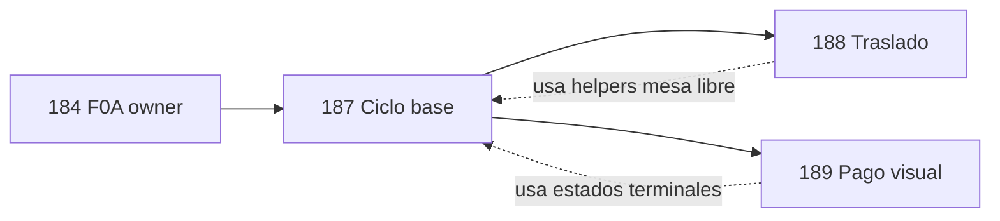

# POS — Ciclo de ocupación, liberación y traslado de mesas

**Documento:** diseño técnico entregas **187 / 188 / 189**  
**Estado:** auditoría + diseño — **sin implementación**  
**Evidencia:** orden `4e6ba009-84ae-421e-9c6b-3217b3863dca` (Sim B F0A)  
**Relacionado:** F0A (184), hotfixes 185/186, `docs/pos-station-technical-design.md`  
**Fecha:** 2026-07-19 (rev. arquitectura 187/188/189)

---

## Resumen ejecutivo

El hallazgo Sim B demostró que una orden `open` con todos los ítems `cancelled` puede mostrarse como mesa libre y reutilizarse por otro mesero, conservando el `owner_profile_id` anterior. F0A funciona; el ciclo de mesa no.

**Decisión de arquitectura:** dividir la corrección en **tres entregas independientes**, cada una con gate de aprobación propio. Este documento conserva la auditoría del comportamiento actual y define contratos, autorizaciones y pruebas por fase.

| Entrega | Alcance |
|---------|---------|
| **187** | Ciclo base: open, release, diagnóstico, índice, UI zombie |
| **188** | Traslado persistido + KDS |
| **189** | Pago robusto + liberación visual del croquis |

**Liberación normal de mesa (negocio):** pago completo → `paid` (implementación visual robusta en **189**; lógica BD ya existe en 064).

---

## 1. Tabla de fases 187 / 188 / 189

| ID | Nombre | Backend | Frontend | Gate aprobación |
|----|--------|---------|----------|-----------------|
| **187** | Ciclo base de servicio de mesa | Diagnósticos read-only; helpers; `open_pos_table_service`; `release_pos_table_service`; advisory lock; idempotencia open/release; índice UNIQUE parcial *(solo si diagnóstico limpio)*; ajuste `pos_floor_has_open_orders` | Estado **Pendiente de cierre**; **Volver al plano** ≠ liberar; renombrar **Salir de vista**; `createOrGetOpenOrder` → RPC open; botón liberar según matriz 187 | `APLICAR 187 EN PREPRODUCCIÓN` |
| **188** | Traslado persistido | `transfer_pos_order_table`; evento `table_transferred`; idempotencia transfer | Reemplazar `trasladarMesa` React-only; UI traslado propietario/supervisor; alerta KDS | `APLICAR 188 EN PREPRODUCCIÓN` |
| **189** | Pago robusto y liberación visual | `idempotency_key` en pagos; anti doble cobro; recuperación post-RPC | Realtime/refresco croquis post-`paid`; deprecar `releaseTable` localStorage en cloud; pruebas caja/split | `APLICAR 189 EN PREPRODUCCIÓN` |

### 1.1 Qué incluye cada fase (detalle)

#### 187 — Ciclo base

- Consultas diagnóstico §8 (read-only).
- Clasificación: servicio activo, zombie, duplicado, con KDS, con pagos.
- RPC `open_pos_table_service` y `release_pos_table_service`.
- Tabla `pos_rpc_idempotency` (open + release).
- `pg_advisory_xact_lock(hashtext('pos_table:' || table_id))`.
- Índice parcial **condicionado** a cero duplicados en diagnóstico.
- UI: `pendiente_cierre`, mensajes zombie, acciones separadas navegación vs liberación.
- **No** implementa traslado ni cambia `create_pos_split_payment`.
- **Compatibilidad:** billing/caja existente sigue operando; órdenes en cobro no liberables por 187.

#### 188 — Traslado

- RPC `transfer_pos_order_table` atómica.
- Misma orden, mismo `owner_profile_id` / `waiter_id`.
- Origen libre + destino ocupado en una transacción.
- Autorización propietario o supervisor según estado.
- Destino ocupado → rechazo (no fusión).
- UPDATE tickets KDS: `pending`, `in_production`, `ready` únicamente.
- Sin modificar `cancelled`, `served`, `problem` (completed).
- Evento `from_table` / `to_table`; alerta KDS visible.
- Idempotencia + concurrencia transfer.

#### 189 — Pago y croquis

- `p_idempotency_key` real en `create_pos_split_payment` (o wrapper).
- Prevención doble cobro server-side.
- Último pago → `paid` atómico *(ya en 064; reforzar idempotencia)*.
- Refresh/realtime croquis al detectar `paid`.
- Pago parcial **no** libera mesa visualmente.
- Recuperación si frontend pierde respuesta RPC (consultar saldo antes de reintentar).
- Tests caja + `SplitPaymentModal`.

---

## 2. Dependencias entre fases



| Dependencia | Detalle |
|-------------|---------|
| **184 → 187** | Obligatoria. Owner inmutable; open asigna owner = actor. |
| **187 → 188** | Obligatoria. Helpers `pos_table_has_active_service`, advisory lock, definición mesa libre/ocupada. |
| **187 → 189** | Recomendada. Croquis deriva ocupación desde BD; estados terminales `paid`/`cancelled`. |
| **188 ⊥ 189** | Independientes entre sí; pueden desplegarse en paralelo tras 187. |
| **185/186** | No revertir; compatibles con 187–189. |

**Orden de despliegue recomendado:** 187 → (188 y 189 en cualquier orden, ideal 188 antes si operan traslados en preprod).

---

## 3. Reglas 187 confirmadas

| # | Regla |
|---|-------|
| R1 | Un `total = 0` **no** libera automáticamente la mesa. |
| R2 | Sin ítems, sin tickets KDS, sin pagos: el **propietario** puede cancelar el servicio. |
| R3 | Solo drafts, nunca enviados: propietario puede limpiar drafts (`clear_pos_order_draft_items`) y cancelar servicio. |
| R4 | Cualquier historial KDS (ítem alguna vez `status NOT IN ('draft','cancelled')` o ticket existente): **supervisor / gerente_general / admin** + motivo obligatorio. |
| R5 | `awaiting_bill` o `sent_to_cashier`: solo **supervisor+**; reversión auditada del flujo de cobro *(RPC revert parcial fuera de 187; release bloqueado hasta revert o acción supervisor documentada)*. |
| R6 | `partially_paid` o cualquier fila en `pos_order_payments` con `status = 'paid'`: **187 no libera** → flujo **189** / reembolso formal. |
| R7 | `paid` / `cancelled`: terminales; abrir mesa crea **nueva** orden y nuevo owner. |
| R8 | Mesero **ayudante** (`auth.uid() ≠ owner_profile_id`) **no** puede liberar. |
| R9 | `owner_profile_id` / `waiter_id` **nunca** se modifican dentro del mismo servicio (F0A). |
| R10 | **Jefe de turno v1 = rol `supervisor`** (no existe rol ni asignación de turno en schema POS hoy). |

---

## 4. Roles, propietario y casos especiales

### 4.1 Equivalencias de rol (v1 — Auth `profiles.role`)

Roles normalizados vía `public.normalize_profile_role(role)` (045/046).

| Concepto negocio | Roles exactos en BD | Función helper 187 |
|------------------|---------------------|-------------------|
| **Operador POS** | `mesero`, `supervisor`, `gerente_general`, `admin`, `cajero`, `caja`, `servicio` | `can_operate_pos_orders()` |
| **Supervisor / jefe de turno** | `supervisor` | `is_pos_supervisor()` *(nuevo en 187)* |
| **Gerencia** | `gerente_general` | `is_pos_general_manager()` |
| **Administración** | `admin` | `is_pos_admin()` |
| **Supervisor+** (release L4/L5 KDS, awaiting_bill) | `supervisor`, `gerente_general`, `admin` | `is_pos_elevated_supervisor()` |
| **Caja (cobro)** | `admin`, `gerente_general`, `supervisor`, `cajero`, `caja` | `is_cash_operator()` — **189**, no 187 release |
| **POS UI hoy** | `mesero`, `supervisor`, `gerente_general`, `admin`, `caja` | `POS_ROLES` en `POS.jsx` |

**No ampliar** roles en 187: mesero ayudante sigue siendo `mesero` con `auth.uid() ≠ owner_profile_id`.

### 4.2 Validación de propietario

```text
is_order_owner(p_order_id) :=
  EXISTS (
    SELECT 1 FROM pos_orders o
    WHERE o.id = p_order_id
      AND o.owner_profile_id = auth.uid()
  )
```

- Fuente canónica: **`owner_profile_id`** (F0A); fallback legacy solo en diagnóstico, no en RPC runtime.
- Si `owner_profile_id IS NULL` (orphan pre-backfill): tratar como **no propietario**; release L2/L3 requiere supervisor+.

### 4.3 Propietario con rol `caja`

Escenario: perfil con `role = 'caja'` abrió mesa *(POS_ROLES incluye `caja`)*.

| Acción | Comportamiento 187 |
|--------|-------------------|
| **open** | Permitido si `can_operate_pos_orders()`; `owner_profile_id = auth.uid()`. |
| **Operar ítems / ayuda** | Igual que mesero. |
| **release L1/L2** | Permitido si `is_order_owner` **independientemente del rol**. |
| **release L3+** | Requiere `is_pos_elevated_supervisor()` — rol `caja` **no** es supervisor+. |
| **Cobro** | vía caja (`is_cash_operator`) — **189**, no 187. |

El rol de caja **no** confiere privilegios de liberación sobre servicios ajenos ni sobre historial KDS.

### 4.4 Ayudante

- `auth.uid() ≠ owner_profile_id` y `can_operate_pos_orders()`.
- Puede agregar ítems, enviar a cocina *(subject to existing RPCs)*.
- **No** puede llamar `release_pos_table_service` (excepto si además es supervisor+ **y** aplica matriz L3/L4).
- **No** puede abrir nuevo servicio en mesa zombie (open rechaza; debe pedir liberación).

---

## 5. Contratos definitivos RPC 187

> **Fuera de 187:** `transfer_pos_order_table` → **188**. Cambios a `create_pos_split_payment` → **189**.

### 5.1 Infraestructura compartida 187

#### Tabla idempotencia

```sql
-- Conceptual; implementar en migración 187
CREATE TABLE public.pos_rpc_idempotency (
  idempotency_key uuid PRIMARY KEY,
  rpc_name text NOT NULL,
  actor_id uuid REFERENCES public.profiles(id),
  resource_key text,          -- ej. 'table:' || table_id o 'order:' || order_id
  result jsonb NOT NULL,
  created_at timestamptz NOT NULL DEFAULT now()
);
-- Retención: job DELETE WHERE created_at < now() - interval '7 days'
```

#### Advisory lock

```sql
PERFORM pg_advisory_xact_lock(hashtext('pos_table_service:' || p_table_id));
-- Liberación usa lock de la mesa de la orden: pos_orders.table_id
```

#### Helpers (SECURITY DEFINER internos)

| Función | Propósito |
|---------|-----------|
| `pos_order_has_active_items(p_order_id)` | ∃ ítem `status <> 'cancelled'` |
| `pos_order_ever_sent_to_kds(p_order_id)` | ∃ ítem `status NOT IN ('draft','cancelled')` OR ∃ ticket |
| `pos_order_has_payments(p_order_id)` | ∃ `pos_order_payments.status = 'paid'` |
| `pos_table_has_blocking_order(p_table_id)` | ∃ orden status ∈ índice parcial en mesa |
| `pos_table_is_zombie_open(p_table_id)` | ∃ orden `open` sin ítems activos, sin pagos |
| `is_pos_elevated_supervisor()` | rol ∈ {supervisor, gerente_general, admin} |
| `is_order_owner(p_order_id)` | §4.2 |

#### Estados en índice parcial UNIQUE (solo dine-in)

Discriminador estructural: columna `sales_channel` (046), valores `dine_in | takeout | delivery | online`. Default `dine_in`. Delivery/takeout usan `table_id` sintético `sales-channel-{canal}-{timestamp}` y **quedan fuera** del índice 187.

Predicado compartido (diagnóstico Q3, gate migración, índice):

```sql
-- public.pos_dine_in_table_service_predicate(sales_channel, table_id, status)
coalesce(nullif(btrim(sales_channel), ''), 'dine_in') = 'dine_in'
AND table_id IS NOT NULL AND btrim(table_id) <> ''
AND status = ANY(ARRAY['open','sent','awaiting_bill','sent_to_cashier','partially_paid'])
```

```sql
CREATE UNIQUE INDEX pos_orders_one_active_service_per_table
  ON public.pos_orders (table_id)
  WHERE public.pos_dine_in_table_service_predicate(sales_channel, table_id, status);
```

**Gate índice (Q3):** duplicados **solo dine-in** por `table_id` → si > 0, **no crear índice**. Canales delivery/takeout/online no participan en Q3 ni en el índice.

**`open_pos_table_service`:** solo `sales_channel = 'dine_in'`. Delivery/takeout conservan `createOrGetOpenOrder` legacy.

**No** cerrar automáticamente las ~13 órdenes `open` del baseline F0A.

**Orden evidencia** `4e6ba009-84ae-421e-9c6b-3217b3863dca`: clasificar en diagnóstico; liberación = **aceptación manual** en ventana acordada, **no** script auto en migración 187.

---

### 5.2 `open_pos_table_service`

```sql
CREATE OR REPLACE FUNCTION public.open_pos_table_service(
  p_table_id text,
  p_table_name text,
  p_area_id text,
  p_area_name text,
  p_sales_channel text DEFAULT 'dine_in',
  p_customer_id uuid DEFAULT NULL,
  p_customer_address_id uuid DEFAULT NULL,
  p_delivery_notes text DEFAULT NULL,
  p_external_source text DEFAULT NULL,
  p_external_order_id text DEFAULT NULL,
  p_idempotency_key uuid
) RETURNS jsonb
LANGUAGE plpgsql
SECURITY DEFINER
SET search_path = ''
```

#### Precondiciones

1. `can_operate_pos_orders()`.
2. `p_table_id` not null/empty.
3. `p_idempotency_key` not null.
4. Idempotencia: si key existe → return `result` almacenado.

#### Algoritmo (transaccional)

1. `pg_advisory_xact_lock(hashtext('pos_table_service:' || p_table_id))`.
2. Si existe orden en mesa con **servicio activo** (status en índice + ítems activos, o en cobro con ítems pendientes de pago):
   - Return `{ reused: true, order_id, owner_profile_id, status }` — **ayuda**, no nuevo UUID.
3. Si existe **zombie** (`open`, sin ítems activos) o orden `open` vacía en mesa:
   - `RAISE EXCEPTION 'POS_TABLE_PENDING_RELEASE'` — no reutilizar silenciosamente.
4. Si mesa en cobro (`awaiting_bill`, `sent_to_cashier`, `partially_paid`):
   - `RAISE EXCEPTION 'POS_TABLE_IN_BILLING'`.
5. `INSERT INTO pos_orders` con:
   - `table_id`, `table_name`, `area_id`, `area_name`, canal, cliente…
   - `waiter_id = auth.uid()`, `owner_profile_id = auth.uid()`, `waiter_name` desde profile
   - `status = 'open'`
6. Trigger existente emite `order_created`; RPC adicional emite `service_opened`.
7. Guardar idempotency `{ created: true, order_id, owner_profile_id }`.
8. On `unique_violation` (si índice ya existe): SELECT orden ganadora → return reused.

#### Respuesta JSON

```json
{
  "created": true,
  "reused": false,
  "order_id": "uuid",
  "owner_profile_id": "uuid",
  "status": "open",
  "table_id": "..."
}
```

#### Errores

| Código / mensaje | Condición |
|------------------|-----------|
| `POS_TABLE_PENDING_RELEASE` | Zombie en mesa |
| `POS_TABLE_IN_BILLING` | Cuenta/cobro en curso |
| `POS_IDEMPOTENCY_KEY_REQUIRED` | Key null |

---

### 5.3 `release_pos_table_service`

```sql
CREATE OR REPLACE FUNCTION public.release_pos_table_service(
  p_order_id uuid,
  p_reason text,
  p_idempotency_key uuid,
  p_force_supervisor boolean DEFAULT false  -- reservado; hoy inferido por matriz
) RETURNS jsonb
LANGUAGE plpgsql
SECURITY DEFINER
SET search_path = ''
```

#### Precondiciones

1. `can_operate_pos_orders()`.
2. `length(trim(p_reason)) >= 10`.
3. `p_idempotency_key` not null.
4. Idempotencia: si key existe → return stored result.

#### Algoritmo (transaccional)

1. `SELECT * FROM pos_orders WHERE id = p_order_id FOR UPDATE`.
2. Si `status = 'cancelled'` → return idempotente `{ released: true, already: true }`.
3. Si `status = 'paid'` → return `{ released: false, reason: 'already_paid' }` (terminal).
4. Evaluar pagos: si `pos_order_has_payments` OR `status = 'partially_paid'` → `RAISE 'POS_RELEASE_BLOCKED_PAYMENTS'` (**R6 → 189**).
5. Clasificar escenario L1–L5 (§6); `assert_release_authorized(order, scenario)`.
6. Si L2 y quedan drafts: llamar `clear_pos_order_draft_items(p_order_id)` internamente.
7. Si L4 (`awaiting_bill` / `sent_to_cashier`): exigir `is_pos_elevated_supervisor()`; registrar en evento que cobro fue revertido **conceptualmente** — RPC revert caja = deuda 189; 187 solo permite cancel bajo supervisión con motivo extendido.
8. `UPDATE pos_orders SET status = 'cancelled', updated_at = now()` — **sin** DELETE.
9. Eventos: `table_released`, `service_cancelled` con `p_reason`, `created_by = auth.uid()`, `authorized_by` si supervisor actuó sobre orden ajena o L3+.
10. Owner/waiter sin cambio (trigger F0A).
11. Guardar idempotency.

#### Respuesta JSON

```json
{
  "released": true,
  "order_id": "uuid",
  "previous_status": "open",
  "scenario": "L3_kds_history",
  "authorized_by": "uuid|null",
  "owner_profile_id": "uuid"
}
```

#### Errores

| Mensaje | Condición |
|---------|-----------|
| `POS_RELEASE_NOT_OWNER` | Ayudante intenta L1/L2 |
| `POS_RELEASE_REQUIRES_SUPERVISOR` | L3/L4 sin elevated role |
| `POS_RELEASE_BLOCKED_PAYMENTS` | R6 — redirigir a 189 |
| `POS_RELEASE_REASON_REQUIRED` | Motivo < 10 chars |

**187 no hace:** reversión inventario, void pagos, DELETE filas, cambio owner.

---

## 6. Matriz definitiva de autorización 187

| Escenario | Condición técnica | Actor permitido | Motivo |
|-----------|-------------------|-----------------|--------|
| **L1** | `open`, 0 ítems, 0 tickets, 0 pagos | **Propietario** | ≥ 10 chars |
| **L2** | `open`, solo drafts, nunca enviados | **Propietario** | ≥ 10 chars; clear drafts |
| **L3** | Cualquier historial KDS | **supervisor**, **gerente_general**, **admin** | ≥ 10 chars obligatorio |
| **L4** | `awaiting_bill` o `sent_to_cashier`, sin pagos | **supervisor+** | ≥ 10 chars + nota reversión cobro |
| **L5** | `partially_paid` o pagos registrados | **Nadie vía 187** | Usar flujo **189** |
| **L6** | `paid` | N/A idempotente | — |
| **L7** | Zombie Sim B (`open`, all cancelled, KDS hist.) | **supervisor+** (R4) | Aceptación manual orden evidencia |
| **—** | Ayudante cualquier L1–L4 | **Denegado** | R8 |
| **—** | `open` servicio activo, otro mesero | **Denegado** release; open devuelve reused | Ayuda |

---

## 7. Precondiciones para crear índice UNIQUE

Checklist **obligatorio** antes de `CREATE UNIQUE INDEX` en migración 187:

| # | Precondición | Consulta |
|---|--------------|----------|
| P1 | Diagnóstico Q1–Q5 ejecutado y exportado | §8 |
| P2 | **Q3 duplicados = 0 filas** | Si > 0 → **STOP**, no índice |
| P3 | Runbook manual para duplicados/zombies acordado con operaciones | Documento aparte |
| P4 | **No** script AUTO `UPDATE status = cancelled` en migración | Manual solamente |
| P5 | Orden `4e6ba009-…` excluida de auto-fix | Aceptación manual |
| P6 | Baseline ~13 `open` preservadas hasta decisión operativa | No auto-close |
| P7 | Ventana de mantenimiento / Sim B completada si aplica | Gate humano |
| P8 | Rollback 187 preparado (DROP INDEX + DROP RPC) | §10 |

Si P2 falla: desplegar RPC 187 **sin** índice; advisory lock sigue serializando; reintentar índice en 187b tras limpieza.

---

## 8. Diagnóstico pre-187 (read-only)

> **No** UPDATE/DELETE/CREATE. Ejecutar `supabase/schema/diagnose_pos_table_service_lifecycle_187.sql` en SQL Editor (postgres). Un solo result set exportable.

### Dimensiones de clasificación (independientes)

| Dimensión | Valores |
|-----------|---------|
| **operational_state** | `active_with_items`, `pending_release_empty`, `pending_release_all_cancelled`, `terminal` |
| **risk_level** | `no_history`, `kds_history`, `billing_state`, `payments_present` |

**Error corregido (preflight):** la clasificación monolítica `active_with_kds_history` ocultaba órdenes `open` sin ítems activos pero con tickets KDS (p. ej. `c8d1e865-…`, `26b09df5-…`). KDS es **riesgo**, no estado operativo.

Summary obligatorio: `pending_release_empty_no_history`, `pending_release_cancelled_no_kds`, `pending_release_with_kds_history`, `pending_release_total`, `active_with_items_total`, `active_billing_total`, `active_with_payments_total`.

Q3 gate: fila `active_service_duplicates`, `is_blocker = true` solo si hay >1 orden dine-in activa por `table_id`.

Orden evidencia `4e6ba009-…`: si tiene draft activo de María → `active_with_items`, **no** pending release.

### Consultas legacy (referencia)

```sql
-- Q1: Clasificación completa órdenes no terminales
SELECT o.id, o.table_id, o.status, o.total, o.owner_profile_id,
  COUNT(i.id) FILTER (WHERE i.status <> 'cancelled') AS active_items,
  COUNT(i.id) FILTER (WHERE i.status NOT IN ('draft','cancelled')) AS ever_sent,
  COUNT(DISTINCT t.id) AS ticket_count,
  COUNT(p.id) FILTER (WHERE p.status = 'paid') AS payment_rows
FROM public.pos_orders o
LEFT JOIN public.pos_order_items i ON i.order_id = o.id
LEFT JOIN public.production_tickets t ON t.order_id = o.id::text
LEFT JOIN public.pos_order_payments p ON p.order_id = o.id
WHERE o.status IN ('open','sent','awaiting_bill','sent_to_cashier','partially_paid')
GROUP BY o.id;

-- Q2: Zombies
SELECT o.id, o.table_id, o.created_at, o.owner_profile_id
FROM public.pos_orders o
WHERE o.status = 'open'
  AND NOT EXISTS (
    SELECT 1 FROM public.pos_order_items i
    WHERE i.order_id = o.id AND i.status <> 'cancelled'
  )
  AND NOT EXISTS (
    SELECT 1 FROM public.pos_order_payments p
    WHERE p.order_id = o.id AND p.status = 'paid'
  );

-- Q3: Duplicados (GATE índice)
SELECT table_id, COUNT(*) AS n, array_agg(id ORDER BY created_at) AS ids
FROM public.pos_orders
WHERE status IN ('open','sent','awaiting_bill','sent_to_cashier','partially_paid')
  AND table_id IS NOT NULL
GROUP BY table_id HAVING COUNT(*) > 1;

-- Q4: Evidencia Sim B
SELECT * FROM public.pos_order_events
WHERE order_id = '4e6ba009-84ae-421e-9c6b-3217b3863dca'
ORDER BY created_at;
```

---

## 9. Tests de aceptación 187

| ID | Caso | Criterio pass |
|----|------|---------------|
| **A1** | Mesa libre, open nuevo | Nuevo `order_id`; owner = actor |
| **A2** | Servicio activo, segundo mesero open | `reused: true`; mismo owner |
| **A3** | Zombie en mesa, open | Error `POS_TABLE_PENDING_RELEASE` |
| **A4** | Tras release L2 propietario, open | Nuevo UUID + owner nuevo |
| **A5** | Ayudante intenta release | Error `POS_RELEASE_NOT_OWNER` |
| **A6** | L3 historial KDS, mesero | Error supervisor requerido |
| **A7** | L3 con supervisor + motivo | `cancelled`; eventos audit |
| **A8** | `partially_paid` release | Error `POS_RELEASE_BLOCKED_PAYMENTS` |
| **A9** | `paid` release | Idempotente / no-op |
| **A10** | Idempotency open mismo key | Misma respuesta, una orden |
| **A11** | Idempotency release mismo key | Una transición cancelled |
| **A12** | Concurrencia 2× open misma mesa | Una orden creada |
| **A13** | UI zombie | Badge **Pendiente de cierre**, no Disponible |
| **A14** | Salir de vista / Volver al plano | Sin cambio BD |
| **A15** | Owner inmutable tras open+release+open | Tres owners distintos en tres servicios |
| **A16** | Orden evidencia | Clasificada Q2/Q4; sin auto-fix en migración |
| **A17** | Q3 > 0 | Migración sin índice; RPC operativos |

**Fuera de aceptación 187:** traslado (→188), pago visual/realtime (→189), ranking post-pago (validar en 189).

---

## 10. Rollback forward-only (por migración)

| Migración | Rollback | Datos |
|-----------|----------|-------|
| **187** | `DROP INDEX IF EXISTS pos_orders_one_active_service_per_table`; `DROP FUNCTION open/release`; `DROP TABLE pos_rpc_idempotency`; restaurar helpers | **Nunca** DELETE órdenes/eventos |
| **188** | `DROP FUNCTION transfer_pos_order_table` | Eventos `table_transferred` permanecen |
| **189** | Revert columnas/idempotency pagos según diseño | Pagos registrados permanecen |

Archivos previstos:

- `supabase/rollback/187_pos_table_service_lifecycle.rollback.sql`
- `supabase/rollback/188_pos_table_transfer.rollback.sql`
- `supabase/rollback/189_pos_payment_idempotency.rollback.sql`

Frontend: feature flag por fase para volver a path legacy si rollback.

---

## 11. Explícitamente fuera de alcance

### 11.1 Fuera de 187 (→ 188 o 189)

| Item | Fase |
|------|------|
| `transfer_pos_order_table` | **188** |
| Actualización KDS tickets en traslado | **188** |
| Alerta KDS “Mesa trasladada” | **188** |
| Mesero propietario traslada mesa | **188** |
| `idempotency_key` en pagos | **189** |
| Anti doble cobro server-side pagos | **189** |
| Realtime croquis post-`paid` | **189** |
| Deprecar `releaseTable` localStorage | **189** |
| Recuperación frontend post-pago | **189** |
| Reversión/reembolso pagos parciales | **189** / F0C |
| PIN supervisor estación | Modo Estación (post 187–189) |
| F0B void post-envío inventario | F0B separado |
| Cambio `owner_profile_id` mid-servicio | F0B |

### 11.2 Fuera de 188

| Item | Fase |
|------|------|
| Fusión de dos órdenes en mesa destino | Nunca v1 |
| Traslado con pagos parciales | Bloqueado |
| Cambio owner en traslado | Prohibido |

### 11.3 Fuera de 189

| Item | Fase |
|------|------|
| Liberación excepcional sin pago | **187** |
| Traslado mesa | **188** |
| Auto-liberar por total=0 | Prohibido (R1) |

---

## 12. Semántica UI 187

| Control | Nombre | Efecto BD |
|---------|--------|-----------|
| Toolbar | **Volver al plano** | Navegación POS |
| Ticket | **Salir de vista** *(renombrar)* | Solo React state |
| Ticket / supervisor | **Cancelar servicio / Liberar mesa** | `release_pos_table_service` |
| Croquis zombie | **Pendiente de cierre** | Warning; no verde Disponible |
| Traslado | *(oculto o disabled en 187)* | Legacy React-only hasta **188** |

Mensajes clave: ver §14 documento anterior (zombie, release L2/L3).

---

## 13. Auditoría — comportamiento actual (referencia)

### 13.1 Evidencia Sim B

Orden `4e6ba009-84ae-421e-9c6b-3217b3863dca`: `open`, owner Juan Carlos, ítems cancelled, croquis Disponible, María reutilizó orden → owner incorrecto para nuevo servicio.

### 13.2 Tres criterios divergentes

| Capa | Criterio |
|------|----------|
| Croquis | Ítems activos |
| Sesión | `status ∉ {paid,cancelled}` |
| BD lookup | Status activos en `getOpenOrderByTable` |

### 13.3 Pago hoy (contexto 189)

- `create_pos_split_payment`: `paid` atómico en BD.
- Croquis: **no** atómico con pago; `releaseTable` solo localStorage.
- Sin `idempotency_key` en pagos.

### 13.4 Traslado hoy (contexto 188)

- `trasladarMesa` (`POS.jsx:4034`): solo React + localStorage; roles `puedeEditarOrdenes`; **no** persiste Supabase/KDS.

---

## 14. Gates de aprobación

| Fase | Frase requerida | Prerequisito |
|------|-----------------|--------------|
| **187** | `APLICAR 187 EN PREPRODUCCIÓN` | Diagnóstico exportado; decisión índice |
| **188** | `APLICAR 188 EN PREPRODUCCIÓN` | 187 desplegado y estable |
| **189** | `APLICAR 189 EN PREPRODUCCIÓN` | 187 desplegado; caja en preprod |

Cada fase: SQL tests BEGIN/ROLLBACK + selftest frontend + Sim B parcial según matriz.

---

## 15. Relación F0A / F0B / Modo Estación

| Fase ERP | Relación |
|----------|----------|
| **F0A (184)** | Owner inmutable; 187 open asigna owner; release/transfer no mutan owner |
| **F0B** | Void post-envío; cambio owner autorizado — distinto de traslado mesa (**188**) |
| **Modo Estación** | PIN supervisor en release/transfer; operator token en open |

---

## 16. Estado de implementación local (187)

| Ítem | Estado |
|------|--------|
| Migración `187_pos_table_service_lifecycle.sql` | **Preparada, no aplicada** |
| Diagnóstico `diagnose_pos_table_service_lifecycle_187.sql` | Preparado (read-only) |
| Tests `187_test_pos_table_service_lifecycle.sql` | Preparados (BEGIN/ROLLBACK) |
| Rollback `187_pos_table_service_lifecycle.rollback.sql` | Preparado (forward-only) |
| Frontend POS (open/release RPC, zombie UI) | Preparado en repo principal |
| Worktree F0A preprod (`alcazar-inventario-f0a-preprod`) | **Sin portar** hasta aprobación |
| SQL remoto / commit / push / deploy | **No ejecutado** |
| Orden evidencia `4e6ba009-…` | Intacta (sin auto-fix en migración) |
| Fases 188 / 189 | Fuera de alcance |

**Gate siguiente:** frase explícita **`APLICAR 187 EN PREPRODUCCIÓN`** → diagnóstico exportado → aplicar SQL → tests → portar frontend al worktree de localhost:5173.

---

## 17. Confirmación de restricciones (entrega preparada 187)

| Restricción | Cumplido |
|-------------|----------|
| Alcance solo 187 (no 188/189) | Sí |
| Sin SQL remoto ni aplicación 187 | Sí |
| Orden `4e6ba009-…` / draft María intactos | Sí |
| Sin revert 184/185/186 | Sí |
| Sin commit / push / deploy | Sí |
| Migración aborta si duplicados dine-in activos por `table_id` | Sí |

---

## 18. Auditoría correctiva pre-aplicación (2026-07-19)

| Hallazgo preflight | Corrección local |
|--------------------|------------------|
| `active_with_kds_history` ocultaba pending release | Diagnóstico dual `operational_state` + `risk_level` |
| Q3 global incluía `sales-channel-*` | Q3/gate/índice acotados a `sales_channel = 'dine_in'` |
| Índice global peligroso para delivery | Predicado `pos_dine_in_table_service_predicate` compartido |
| 7 `sent_to_cashier` sin pagos | `risk_level = billing_state`; no auto-liberar |
| 7 empty open | `pending_release_empty`; liberación manual 187 |
| 2 open all-cancelled + KDS | `pending_release_all_cancelled` + `kds_history`; supervisor+ |
| Orden evidencia con draft María | `active_with_items` cuando `active_item_count > 0` |

**Discriminador confirmado:** `sales_channel` (046) — no se requiere columna nueva.

**Riesgo delivery/takeout:** bajo tras acotar índice; cada pedido usa `table_id` único con timestamp; `createOrGetOpenOrder` legacy no colisiona con mesas físicas.

---

**Detenido.** Esperar aprobación **`APLICAR 187 EN PREPRODUCCIÓN`** antes de aplicar SQL o portar al worktree F0A.
