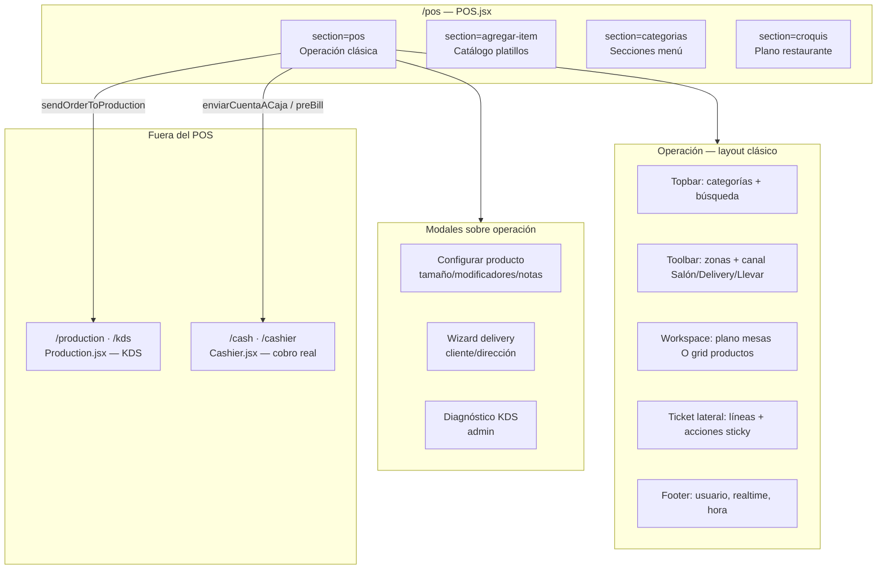

# Auditoría UX operativa — POS (Punto de Venta)

**Fecha:** 2026-06-09  
**Alcance:** Flujos operativos del POS — **sin cambios de código**.  
**Referencias:** [ui-audit.md](./ui-audit.md) · [erp-ui-spacing-system.md](./erp-ui-spacing-system.md) · Sprint UX #1 cerrado (Áreas, InventoryBase, Caja).

**Archivos revisados:** `pages/POS.jsx`, `pages/POS.css`, `components/PosClassicOperation.jsx`, `components/PosServiceTerminal.jsx`, `components/PosTicketPanel.jsx`, `pages/Production.jsx` (KDS), integración `pages/Cashier.jsx`.

---

## Resumen ejecutivo

El POS **clásico pizzería** (`PosClassicOperation`) prioriza velocidad con layout **plano + menú + ticket lateral**. La lógica de negocio es sólida (Supabase, RPC a cocina, realtime, bridge a caja), pero hay **fricción operativa** en:

1. **Salida automática** tras enviar a cocina (pierde contexto de mesa).
2. **Controles de línea desconectados** — funciones `cambiarCantidad`, `handleMarkServed`, edición de notas existen en `POS.jsx` pero **no están en el ticket UI**.
3. **Cobro no ocurre en POS** — el botón «Cobrar» envía a caja; naming puede confundir al mesero.
4. **Delivery** con wizard pesado y envío dual cocina+caja en un solo paso.
5. **Spacing System v1.0** — deuda alta (49 valores prohibidos, breakpoints no estándar); no bloquea operación pero reduce consistencia tablet/móvil.

| Prioridad | Cantidad estimada | Enfoque Sprint UX #2 |
|-----------|-------------------|----------------------|
| **P1** — Velocidad / errores operativos | 9 | Comportamiento UI + flujos críticos |
| **P2** — Inconsistencia visual / táctil | 12 | Tokens, breakpoints, jerarquía |
| **P3** — Cosmético | 8 | Pulido admin, duplicados, copy |

---

## Mapa de pantallas



### Rutas y roles

| Ruta | Componente | Roles típicos | Uso operativo |
|------|------------|---------------|---------------|
| `/pos` o `?section=pos` | `PosClassicOperation` | mesero, supervisor, caja, admin | Servicio diario |
| `/pos?section=agregar-item` | `PosDishCatalog` | gerencia, admin | Alta/edición platillos |
| `/pos?section=categorias` | Admin categorías | gerencia operaciones | Menú |
| `/pos?section=croquis` | Editor plano | gerencia operaciones | Mesas/zonas |
| `/production`, `/kds` | `Production.jsx` | cocina, barra | KDS tickets |
| `/cash`, `/cashier` | `Cashier.jsx` | caja | Pago, propina, cierre |

---

## 1. Flujo de mesero (salón / dine-in)

### Camino feliz — tomar orden y enviar a cocina

| Paso | Acción | Clics / interacciones | Distancia visual |
|------|--------|----------------------|------------------|
| 1 | Abrir POS | 1 (sidebar) | — |
| 2 | Elegir **zona** del plano (si hay varias) | 0–1 | Toolbar izquierda |
| 3 | **Tocar mesa** en canvas | 1 | Centro pantalla (alejado del ticket) |
| 4 | Tocar **categoría** en topbar | 1 | Arriba — abre catálogo |
| 5 | Tocar **producto** | 1 | Grid central |
| 6 | Modal: tamaño (pizza), modificadores, notas, asignación silla | 2–8+ | Modal centrado — **bloquea** vista mesa |
| 7 | «Agregar a la orden» | 1 | Modal |
| 8 | Repetir 4–7 por ítem | N × (3–10) | — |
| 9 | Desplazarse al **ticket lateral** | scroll | Panel derecho (debajo en ≤1100px) |
| 10 | **Enviar a cocina** | 1 | Sticky bottom ticket — **crítico** |
| 11 | Auto: toast + **salir de mesa a los 1.5s** | 0 | ⚠️ Resetea vista |

**Clics mínimos (1 pizza, sin extras):** ~8–10 antes de cocina.  
**Clics mínimos (3 ítems simples):** ~14–18.

### Cuellos de botella — mesero

| ID | Problema | Prioridad | Evidencia |
|----|----------|-----------|-----------|
| M1 | Tras **Enviar a cocina**, `setTimeout` 1.5s limpia mesa/orden — mesero debe **reabrir mesa** para seguir servicio o cobrar | **P1** | `handleSendOrderToProduction` L2624–2640 |
| M2 | **No hay +/-** ni editar línea en `PosTicketPanel` — `cambiarCantidad` / `guardarModificacionActual` **sin UI** | **P1** | `POS.jsx` L2511+, ticket solo lectura L132–141 |
| M3 | Productos **listos** (`ready`): badge en ticket + toast realtime, pero **`handleMarkServed` sin botón** en ticket | **P1** | `readyItemsCount`, L2669+ sin wiring |
| M4 | Cambio plano ↔ menú: categoría **siempre** abre catálogo; volver al plano requiere «← Volver al plano» | **P2** | `onSelectCategory` + toolbar |
| M5 | **Total duplicado** (hero + meta-grid) — ruido visual en ticket estrecho | **P3** | `PosTicketPanel` L61–83 |
| M6 | Canal Delivery/Llevar en esquina superior derecha — lejos del plano en tablet | **P2** | `PosServiceTerminal` channel toggle |
| M7 | Utilidades en grid **3 columnas** (Separar, Imprimir, Solicitar…) — targets pequeños en móvil (gap 6px) | **P2** | `POS.css` L2545–2548 |
| M8 | «Cobrar» en POS **no cobra** — envía a caja (nombre ambiguo para mesero) | **P1** | `onSendCashier` → `enviarCuentaACaja` |

### Uso móvil / tablet — mesero

| Viewport | Comportamiento | Riesgo |
|----------|----------------|--------|
| **Desktop ≥1100px** | Plano + ticket lado a lado — óptimo | Bajo |
| **Tablet 768–1100px** | Ticket **debajo** del workspace; sticky acciones; líneas max 36vh | Medio — scroll extra |
| **Mobile ≤760px** | Categorías 2 cols; utilidades 2 cols; plano comprimido | **Alto** — POS no es first-class mobile |

---

## 2. Flujo de cajero

El **cajero no cobra dentro del POS**. El puente es:

```
POS «Cobrar» / «Solicitar cobro» / «Imprimir»
  → createPreBillFromPOSOrder (local bridge)
  → sendOrderToCashier + sendPreBillToCashier
  → Cashier: solicitudes de cobro → terminal cobro
```

### Camino desde POS (mesero o rol caja en POS)

| Acción POS | Handler | Efecto | Clics hasta caja |
|------------|---------|--------|------------------|
| **Cobrar** (primario) | `enviarCuentaACaja` | Precuenta + estado `sent_to_cashier` + notificación caja | 1 (si `canRequestCashier`) |
| **Solicitar cobro** (utilidad) | `solicitarCuenta` | `awaiting_bill` + precuenta local | 1 |
| **Imprimir** | `imprimirPrecuenta` | Precuenta impresa + awaiting bill | 1 |
| **Separar** | `dividirCuentaIgual` | `prompt` partes → split → envía caja | 2+ (prompt nativo) |

**Precondición `canRequestCashier`:** sin ítems `draft`, datos delivery completos, orden activa.

### Camino en Cashier (cajero)

| Paso | Acción | Notas |
|------|--------|-------|
| 1 | Abrir `/cash` | Dashboard o tab Solicitudes |
| 2 | Seleccionar solicitud / Cobrar mesa | Hero + ítems + totales |
| 3 | Método pago, propina, confirmar | Sprint UX #1: cards mobile ítems |
| 4 | Recibo | — |

### Cuellos de botella — cajero

| ID | Problema | Prioridad |
|----|----------|-----------|
| C1 | Mesero debe **eliminar drafts** antes de Cobrar — si olvida enviar a cocina, botón deshabilitado sin CTA claro | **P1** |
| C2 | **Separar cuenta** usa `window.prompt` — lento y frágil en tablet | **P1** |
| C3 | Dos acciones similares: **Cobrar** vs **Solicitar cobro** — duplicidad conceptual | **P2** |
| C4 | POS no muestra estado «**En caja**» persistente tras salir de mesa (auto-reset M1) | **P1** |

---

## 3. Flujo de delivery

### Camino feliz

| Paso | Acción | Clics |
|------|--------|-------|
| 1 | Canal **Delivery** (toolbar derecha) | 1 |
| 2 | Modal wizard — buscar/crear cliente, dirección, forma pago | 5–15+ |
| 3 | Guardar → crea orden Supabase | 1 |
| 4 | Agregar productos (catálogo) | N |
| 5 | **Enviar a cocina** | 1 |
| 6 | Automático: **envío a caja** + reset vista 1.5s | 0 |

### Cuellos de botella — delivery

| ID | Problema | Prioridad |
|----|----------|-----------|
| D1 | Wizard modal **bloqueante** antes de cualquier producto — alto costo en hora pico | **P1** |
| D2 | Indicador «Paso 2 de 5» pero flujo real fragmentado (modal vs operación) | **P2** |
| D3 | Panel inline «Configurar delivery» + modal — **doble entrada** | **P2** |
| D4 | Envío a cocina **siempre** dispara envío a caja — correcto operativamente pero sin confirmación visual fuerte | **P2** |
| D5 | Validación repite en enviar cocina + caja — errores tardíos | **P1** |
| D6 | `deliveryForm` reset tras envío — ok, pero pierde trazabilidad si error post-envío | **P3** |

---

## 4. Flujo de cocina (KDS)

**Pantalla separada:** `/production` — no embebida en POS.

### Pipeline ticket

```
pending → in_production → ready → served
         (Comenzar)      (Listo)   (Retirado/servido)
```

| Actor | Acción | Pantalla |
|-------|--------|----------|
| Mesero | Enviar a cocina | POS |
| Cocina | Comenzar / Listo / Servido | KDS |
| Mesero | Recibe toast «productos listos» | POS realtime |
| Mesero | Entregar y marcar servido | **⚠️ Sin UI en ticket** |

### Cuellos de botella — cocina

| ID | Problema | Prioridad |
|----|----------|-----------|
| K1 | POS → KDS vía RPC `sendOrderToProduction` — OK; fallos inventario muestran panel errores **abajo del ticket** | **P2** |
| K2 | Mesero no puede **marcar servido** desde POS (handler huérfano) — desincroniza KDS vs servicio | **P1** |
| K3 | KDS usa `Production.css` — spacing no alineado; botones estado OK para cocina | **P3** |
| K4 | Áreas productivas (cocina, pizzeria, barra) — tickets filtrados por área; cambio área en KDS | **P2** (operación multi-estación) |

---

## 5. Flujo de modificación de órdenes

### Al agregar (configuración)

| Capacidad | UI | Clics extra |
|-----------|-----|-------------|
| Tamaño pizza | Modal chips | +1–2 |
| Modificadores | Toggle buttons en modal | +0–N |
| Notas cocina | Textarea | 0–1 |
| Asignación silla | Select (modal + ticket) | 0–1 |

### Post-agregado (líneas en ticket)

| Capacidad | Estado UI | Prioridad gap |
|-----------|-----------|---------------|
| Cambiar cantidad draft | **No expuesto** | **P1** |
| Editar notas línea | **No expuesto** (`editandoModificacionLineId`) | **P1** |
| Anular pendientes (solo draft) | Botón «Anular pendientes» | OK |
| Cancelar enviado | `window.prompt` + autorización supervisor | **P2** — usable pero lento |
| Bloqueo por cobro | `mesaBloqueadaPorCobro` deshabilita add/send | OK — mensaje claro |

### Pizza / variantes

- Configuración solo en **momento de agregar** — no reconfigurar línea después sin cancelar.

---

## 6. Flujo de pago

| Etapa | Dónde | Qué ocurre |
|-------|-------|------------|
| Precuenta | POS | Imprimir / solicitar |
| Bridge | `utils/cashier.js` | `createPreBillFromPOSOrder` |
| Cobro | **Cashier** | Efectivo, tarjeta, mixto, split modal |
| Cierre orden | Supabase + Cashier | Fuera alcance POS |

**POS no calcula propina ni descuento final** — eso es en Caja (Sprint #1 alineado).

### Cuellos de botella — pago

| ID | Problema | Prioridad |
|----|----------|-----------|
| P1 | Label **«Cobrar»** implica pago in-app | **P1** |
| P2 | `canRequestCashier` requiere cero drafts — mensaje en hint pero fácil de ignorar | **P1** |
| P3 | Split por persona (`prepararCobroPorPersona`) existe pero **no en ticket clásico** | **P2** |
| P4 | Rol **caja** en POS ve mismos botones — puede confundir con terminal Cashier | **P2** |

---

## Botones críticos (jerarquía operativa)

| Botón | Ubicación | Altura aprox. | Cumple táctil 44/48/52 | Notas |
|-------|-----------|---------------|------------------------|-------|
| **Enviar a cocina** | Ticket sticky primario | 54px | Parcial (desktop OK) | Naranja — bien destacado |
| **Cobrar** | Ticket sticky primario | 54px | Parcial | Verde — renombrar «Enviar a caja» |
| Categoría menú | Topbar | 52px | Sí | Buen target |
| Producto grid | Workspace | ~card completa | Sí | Bueno para velocidad |
| Utilidades (×5) | Ticket grid 3col | 54px | Tablet/móvil apretado | **P2** |
| Anular / Salir mesa | Ticket danger zone | 54px | Sí | Borde dashed — visible |
| Mesa (plano) | Canvas | 144–160px mobile | Sí | Buen target |
| KDS transiciones | Production | variable | Revisar ≤48px algunos | **P2** |

---

## Consistencia — ERP UI Spacing System v1.0

| Criterio | Estado POS | Impacto operativo |
|----------|------------|-------------------|
| Tokens `--erp-space-*` | **No** en `POS.css` (parcial en `--erp-primary`, `--erp-border`) | Bajo directo; afecta tablet |
| Breakpoints 767 / 1024 / 1440 | **No** — usa 720, 760, 980, 1100, 1180 | Layout saltos inconsistentes |
| Valores prohibidos (3,7,11…) | **~49** instancias | **P2** |
| Inline styles modales | **~19** bloques en `POS.jsx` | **P2** — modales críticos fuera CSS |
| Alturas táctiles | Mix 36–54px; utilidades 38px | **P2** |
| Cards / grid producto | Espíritu POS correcto (velocidad) | Alinear sin reducir tamaño cards |

**Principio Sprint UX #2 POS:** tokenizar **sin reducir** targets de categorías/productos/acciones primarias.

---

## Mejoras sugeridas (sin implementar)

### P1 — Velocidad operativa (implementar primero)

| # | Mejora | Flujo | Esfuerzo |
|---|--------|-------|----------|
| 1 | **Quitar auto-reset** 1.5s post-envío cocina; opcional «Nueva mesa» explícito | Mesero | Bajo |
| 2 | Exponer **+/- cantidad** y **editar nota** en líneas draft del ticket | Modificación | Medio |
| 3 | Botón **Marcar servido** en líneas `ready` | Mesero ↔ Cocina | Medio |
| 4 | Renombrar **«Cobrar» → «Enviar a caja»**; tooltip consistente | Pago / cajero | Bajo |
| 5 | Si `canRequestCashier` false por drafts: **CTA inline** «Tienes N sin enviar → Enviar a cocina» | Pago | Bajo |
| 6 | **Separar cuenta**: modal ERP en lugar de `prompt` | Cajero | Medio |
| 7 | Delivery: **modo rápido** — cliente mínimo inline, wizard opcional | Delivery | Medio |
| 8 | Persistir **badge mesa «En caja»** en plano tras envío | Mesero / cajero | Medio |
| 9 | Wiring handlers huérfanos o eliminar código muerto (auditoría técnica) | Mantenimiento | Bajo |

### P2 — Inconsistencia visual / táctil

| # | Mejora |
|---|--------|
| 10 | Migrar `POS.css` a tokens; breakpoints **767 / 1024 / 1440** |
| 11 | Utilidades ticket: 2 filas × 2 cols mobile; gap **8/16px** |
| 12 | Modales producto/delivery: clases `.erp-form-section` + `.erp-form-grid` |
| 13 | Unificar topbar + toolbar spacing (eliminar 6px, 10px, 14px) |
| 14 | Indicador canal activo más prominente cerca del ticket |
| 15 | KDS: botones mínimo `--erp-btn-height` |

### P3 — Cosmético

| # | Mejora |
|---|--------|
| 16 | Quitar total duplicado en ticket meta-grid |
| 17 | Alinear admin sections (agregar-item, croquis) — fuera turno servicio |
| 18 | Footer POS: tokens padding |
| 19 | Leyenda plano mesas — tipografía spacing |
| 20 | Wizard delivery: copy pasos vs flujo real |

---

## Riesgos de implementación (Sprint UX #2)

| Riesgo | Mitigación |
|--------|------------|
| Romper **velocidad** al tokenizar — cards producto más pequeños | Regla: no bajar min-height categoría/producto/acción primaria |
| Auto-reset removido — mesas «fantasma» abiertas en UI | Mantener «Salir de mesa» + estado en plano |
| Exponer +/- — ediciones accidental | Solo status `draft`; confirm en cantidad 0 |
| Renombrar Cobrar — training staff | Copy + iconografía consistente con Cashier |
| Delivery modo rápido — validación legal/fiscal | Mantener validación completa antes de **enviar a cocina** |
| CSS POS ~2800 líneas — regresión visual | Cambios incrementales: operación clásica primero, admin después |
| KDS fuera de POS.css | Sprint separado o sub-fase Production.css |

---

## Prioridad de implementación recomendada

### Fase A — Operación mesero (P1, 1–2 sprints)

1. Auto-reset post-cocina (M1)  
2. Wiring +/- y notas draft (M2)  
3. Marcar servido (M3, K2)  
4. Copy Cobrar → Enviar a caja (M8, P1)  
5. CTA drafts bloqueando cobro (C1, P2)

### Fase B — Caja bridge + delivery (P1/P2)

6. Modal separar cuenta (C2)  
7. Delivery flujo rápido (D1)  
8. Estado mesa en plano post-envío caja (C4)

### Fase C — Spacing System POS (P2, paralelizable parcial)

9. Import `erp-ui-spacing.css` + tokens shell clásico  
10. Breakpoints 767/1024/1440  
11. Modales a clases ERP  
12. Ticket utilities grid mobile  

### Fase D — Admin POS (P3, fuera hora pico)

13. `agregar-item`, `categorias`, `croquis` — tokens only  

---

## Smoke tests sugeridos (post Sprint UX #2)

### Mesero salón

- [ ] Mesa nueva → 2 productos (1 pizza con mods) → enviar cocina → **mesa sigue seleccionada**
- [ ] +/- cantidad draft antes de enviar
- [ ] Ítem ready → marcar servido → badge desaparece
- [ ] Enviar a caja → plano muestra estado cobro → Cashier recibe solicitud

### Delivery

- [ ] Canal delivery → cliente mínimo → productos → cocina → caja automática
- [ ] Validación campos antes de enviar (teléfono, dirección)

### Cajero

- [ ] Solicitud desde POS → cobrar en Cashier → orden cerrada
- [ ] Separar cuenta 3 partes sin `prompt`

### Cocina

- [ ] Ticket aparece en KDS al enviar
- [ ] Flujo pending → ready → servido reflejado en POS

### Responsive

- [ ] Tablet 768px: acciones primarias visibles sin scroll excesivo
- [ ] Mobile 375px: utilidades usables (aceptar limitación POS móvil)

### Consola / build

- [ ] Sin errores JS en flujos anteriores
- [ ] `npm run build` OK

---

## Relación con backlog UX

| Documento | Uso |
|-----------|-----|
| [ui-audit.md](./ui-audit.md) | Deuda spacing/grid POS (P1 técnico) |
| [ui-remediation-sprint-1.md](./ui-remediation-sprint-1.md) | Caja ya alineada — flujo pago depende de ello |
| **pos-ux-audit.md** (este) | **Priorizar P1 operativos antes/durante tokenización POS** |

---

*Auditoría operativa estática — 2026-06-09. Sin cambios de código.*
